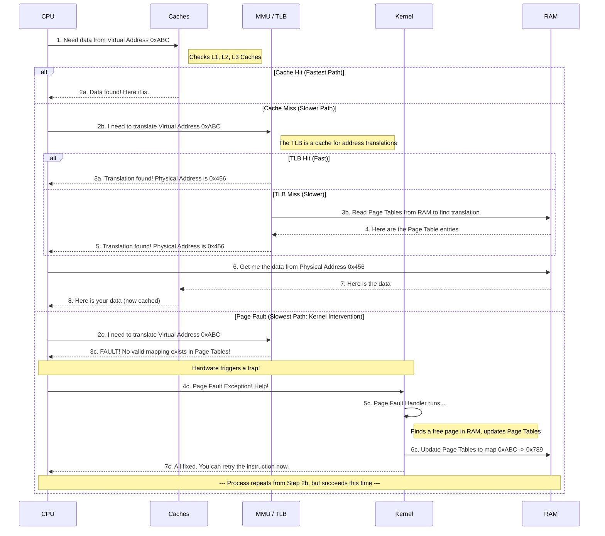

# Chapter 12: [Memory Management]

## **Summary**

### Introduction
- **Overview**: Kernel memory allocation is complex compared to user-space due to limited error handling and sleep restrictions.
- **Challenges**:
	- Kernel can’t easily handle allocation failures (no robust error recovery like user-space).
	- Often can’t sleep, requiring lightweight (fast and reliable) allocation methods.
- **Purpose**: Chapter discusses kernel memory allocation interfaces and underlying memory management concepts.
- **Real-World Analogy**: Like a library (kernel) managing books (memory) with strict rules, unlike a bookstore (user-space) with flexible restocking.
- **Additional Clarifications**:
	- Kernel allocations prioritize speed and reliability over flexibility (unlike user-space’s `malloc`).
	- Sleep restrictions arise in interrupt contexts or critical sections where delays are unsafe.
	- **Real-World Analogy**: Like a library needing quick book access (allocations) without pausing operations, unlike a bookstore waiting for shipments.

### Pages
- The kernel treats physical pages as the basic unit of memory management.
- Although the processor’s smallest addressable unit is a byte or a word, the memory management unit(MMU, the hardware that manages memory and performs virtual to physical address translations) typically deals in pages.
- Therefore, the MMU maintains the system’s page tables with page-sized granularity (hence their name). In terms of virtual memory, pages are the smallest unit that matters.
- **Page Size**:
	- Varies by architecture (e.g., `4KB` for 32-bit, `8KB` for 64-bit).
	- On a machine with `4KB` pages and `1GB` of memory, physical memory is divided into 2,62,144 (`(1024*1024)KB/4KB`) distinct pages.
	- Example: `4GB` memory with `4KB` pages = 10,48,576 pages.
- The kernel represents *every* physical page on the system with a `struct page` structure. This structure is defined in `<linux/mm_types.h>`.
- A simplified definition of the `struct page`, removing two confusion unions for the sake of discussion is:
  ```c
	struct page {
		unsigned long flags;
		atomic_t _count;
		atomic_t _mapcount;
		unsigned long private;
		struct address_space *mapping;
		pgoff_t index;
		struct list_head lru;
		void *virtual;
	};
  ```
	- `flags`
		- stores the status of the page.
		- `flags` include whether the page is dirty or whether it is locked in memory.
		- The flag values are defined in `<linux/page-flags.h>`.
	- `_count`
		- stores the usage count of the page—that is, how many references there are to this page.
		- When this count reaches negative one, no one is using the page, and it becomes available for use in a new allocation.
		- Kernel code should not check this field directly but instead use the function `page_count()`, which takes a `page` structure as its sole parameter.
		- Although internally `_count` is negative one (`-1`) when the page is free, `page_count()` returns zero (`0`) to indicate free and a positive nonzero integer when the page is in use.
	- `mapping`: Points to `address_space` object associated with this page (e.g. for page cache).
	- `private`: Points to private data if used.
	- `index`: Offset in mapping.
	- `lru`: Links pages in least-recently-used list.
	- `virtual`: page’s virtual address; NULL for high memory (not permanently mapped in the kernel's address space).
- **Purpose**:
	- Tracks physical pages (not virtual) to manage ownership (e.g., user-space, kernel, page cache).
	- Enables kernel to identify free pages or owners for allocation/reclamation.
- **Space Overhead**:
	- Example: 40-byte `struct page`, `4GB` memory, `8KB` pages = `20MB` for 524,288 pages (small fraction of total memory).
- **Real-World Analogy**: Like a library catalog card (`struct page`) for each book (physical page), tracking if it’s borrowed, reserved, or free.
- **Modern Usage**:
	- Page sizes configurable (e.g., huge pages, `2MB`/`1GB`) for performance (see `mm/huge_memory.c`).
	- `struct page` evolved with additional fields for modern features (e.g., memory `cgroups`).
	- Transparent Huge Pages (`THP`) reduce `TLB` misses (see `mm/transparent_hugepage.c`).
	- Memory hotplug dynamically manages pages (see `mm/memory_hotplug.c`)


### Zones
- **Definition**: Kernel divides physical pages into zones to group pages with similar properties, addressing hardware limitations.
- **Hardware Limitations**:
	- Some devices (e.g., ISA) can only perform DMA to specific memory addresses (e.g., <`16MB` on x86).
	- Some architectures (e.g., 32-bit x86) can’t map all physical memory into kernel’s virtual address space.
- **Primary Zones** (`<linux/mmzone.h>`):
	- **ZONE_DMA**: Pages for DMA (e.g., `0`–`16MB` on x86 for ISA devices).
	- **ZONE_DMA32**: Pages for DMA by 32-bit devices (larger range on some architectures).
	- **ZONE_NORMAL**: Regularly mapped pages (e.g., `16`–`896MB` on x86).
	- **ZONE_HIGHMEM**: High memory, not permanently mapped (e.g., >`896MB` on x86-32).
- **Architecture Dependency**:
	- **x86-32**: ZONE_DMA (<`16MB`), ZONE_NORMAL (`16`–`896MB`), ZONE_HIGHMEM (>`896MB`).
	- **x86-64**: No ZONE_HIGHMEM (all memory mapped); ZONE_DMA, ZONE_NORMAL used.
	- Some architectures: ZONE_DMA empty if no DMA restrictions.
- **Purpose**:
	- Groups pages for specific needs (e.g., DMA allocations from ZONE_DMA).
	- Ensures kernel can satisfy allocation requirements despite hardware constraints.
- **Allocation Rules**:
	- DMA allocations: Must come from ZONE_DMA or ZONE_DMA32.
	- Normal allocations: Prefer ZONE_NORMAL, but can use ZONE_DMA if needed.
	- Allocations can’t cross zones (e.g., one allocation can’t mix ZONE_NORMAL and ZONE_DMA).
- **What is high memory?**
	- Pages not permanently mapped in kernel’s address space (e.g., >`896MB`on x86-32), requiring dynamic mapping. It saves kernel virtual address space on 32-bit systems.
- **Structure**:
  ```c
	struct zone {
		unsigned long watermark[NR_WMARK];
		unsigned long lowmem_reserve[MAX_NR_ZONES];
		struct per_cpu_pageset pageset[NR_CPUS];
		spinlock_t lock;
		struct free_area free_area[MAX_ORDER]
		spinlock_t lru_lock;
		struct zone_lru {
			struct list_head list;
			unsigned long
			nr_saved_scan;
		} lru[NR_LRU_LISTS];
		struct zone_reclaim_stat reclaim_stat;
		unsigned long pages_scanned;
		unsigned long flags;
		atomic_long_t vm_stat[NR_VM_ZONE_STAT_ITEMS];
		int prev_priority;
		unsigned int inactive_ratio;
		wait_queue_head_t *wait_table;
		unsigned long wait_table_hash_nr_entries;
		unsigned long wait_table_bits;
		struct pglist_data *zone_pgdat;
		unsigned long zone_start_pfn;
		unsigned long spanned_pages;
		unsigned long present_pages;
		const char *name;
	};
  ```
	- `lock`: Spinlock for structure protection (not for pages).
	- `watermark[NR_WMARK]`: Min/low/high watermarks for memory management.
	- `name`: String (e.g., "DMA", "Normal", "HighMem"), set in `mm/page_alloc.c`.
	- Other fields: Manage free pages, LRU lists, statistics (e.g., `pages_scanned`, `vm_stat`).
	- **Space Overhead**: Only three zones per system, so minimal memory for struct zone.
	- **Real-World Analogy**: Like a library sorting books (pages) into sections (zones) for special uses (e.g., rare books for DMA, general shelves for normal).
	- **Modern Usage**:
		- Zones extended for memory `cgroups`, NUMA (see `mm/numa.c`).
		- ZONE_MOVABLE for hotplug memory, reducing ZONE_HIGHMEM use on modern systems.
	- **Additional Clarifications**:
		- **Zone Layout**: Architecture-specific (e.g., x86-32 has all zones; x86-64 omits ZONE_HIGHMEM).
		- **Watermarks**: Guide kernel’s memory reclamation (e.g., when free memory falls below min/low).
		- **DMA Restrictions**: On x86, ISA devices limited to `16MB`; some PCI devices to 24-bit (`16MB`–`4GB`).
		- **Zone Preference**: Kernel prioritizes ZONE_NORMAL to preserve ZONE_DMA for specific needs.


### Getting Pages
- **Overview**: Kernel provides low-level functions to allocate/free physical pages, operating at page-sized granularity (`<linux/gfp.h>`).
- **Allocation Functions**:
	- `struct page *alloc_pages(gfp_t gfp_mask, unsigned int order)`:
		- Allocates `2^order` contiguous physical pages, returns struct page pointer to first page.
		- Returns NULL on failure.
	- `void *page_address(struct page *page)`:
		- Converts struct page to logical (virtual) address.
	- `unsigned long __get_free_pages(gfp_t gfp_mask, unsigned int order)`:
		- Allocates `2^order` pages, returns logical address of first page.
	- **Single-page wrappers**:
		- `struct page *alloc_page(gfp_t gfp_mask)`:
			- Allocates 1 page (order=0), returns `struct page`.
		- `unsigned long __get_free_page(gfp_t gfp_mask)`:
			- Allocates 1 page, returns logical address.
	- **Zeroed page**:
		- `unsigned long get_zeroed_page(gfp_t gfp_mask)`:
			- Allocates 1 page, zeros it, returns logical address.
		- Purpose: Ensures no sensitive data (e.g., for user-space).
- **Freeing Functions**:
	- `void __free_pages(struct page *page, unsigned int order)`:
		- Frees `2^order` pages from struct page.
	- `void free_pages(unsigned long addr, unsigned int order)`:
		- Frees `2^order` pages from logical address.
	- `void free_page(unsigned long addr)`:
		- Frees 1 page from logical address.
- **Usage Example**:
  ```c
	unsigned long page;
	page = __get_free_pages(GFP_KERNEL, 3);
	if (!page) { 
		/* insufficient memory: you must handle this error! */
		return –ENOMEM;
	}
	/* ‘page’ is now the address of the first of eight contiguous pages ... */
	//And here we free the eight pages, after we are done using them: 
	free_pages(page, 3);
	/*
	 * our pages are now freed and we should no
	 * longer access the address stored in ‘page’
	 */
  ```
- **Key Notes**:
	- Allocations are contiguous physical pages; `gfp_mask` specifies allocation behavior (e.g., `GFP_KERNEL` for normal kernel context).
	- Must free only allocated pages with correct `order` to avoid corruption.
	- Error handling critical: Check for `NULL` or `-ENOMEM`; allocate early to simplify cleanup.
	- Zeroing pages (e.g., `get_zeroed_page()`) prevents leaking sensitive data to user-space.
- **Modern Usage**:
	- `GFP_KERNEL` remains standard, but `GFP_DMA` used for ZONE_DMA allocations.
	- Page allocation optimized with buddy allocator. Buddy allocator improvements reduce fragmentation (see `mm/page_alloc.c`)
	- `alloc_pages_exact()` for non-power-of-2 allocations in modern kernels.
- **Why use `alloc_pages()` vs. `__get_free_pages()`?**
	- `alloc_pages()` returns `struct page` for kernel tracking (e.g., page cache); `__get_free_pages()` returns logical address for direct access.
	- **Purpose**: Matches use case (tracking vs. immediate use).
- **Additional Clarifications**:
	- **`gfp_mask`**: Controls allocation context (e.g., `GFP_KERNEL` for process context, `GFP_ATOMIC` for interrupt-safe).
	- **Contiguous Pages**: `2^order` pages are physically contiguous, critical for DMA or hardware access.
	- **Error Handling**: Allocate early to simplify unwinding; use `-ENOMEM` for failure.
	- **Relation to Zones**: Allocations may target specific zones (e.g., ZONE_DMA for `GFP_DMA`).
	- **Page vs. Byte Allocations**: Page functions for large, page-aligned needs; `kmalloc()` for smaller, byte-sized allocations (discussed later).
- **Real-World Analogy**: Like a library reserving specific book stacks (ZONE_DMA) or general ones (ZONE_NORMAL), ensuring they’re clean (zeroed) for sensitive readers and properly returned.


### kmalloc()
- **Overview**: `kmalloc()` provides a simple interface for allocating **byte-sized**, **physically contiguous** memory chunks, similar to user-space `malloc()`.
- **Function**: Declared in <linux/slab.h>:
  ```c
	void *kmalloc(size_t size, gfp_t flags)
  ```
	- Returns pointer to ≥`size` bytes (may allocate more, rounded to page boundaries).
	- Returns **NULL** on failure (e.g., insufficient memory).
	- **Check**: Always verify for NULL to handle errors.
- **Usage Example**:
  ```c
	struct dog *p = kmalloc(sizeof(struct dog), GFP_KERNEL);
	if (!p)
		return -ENOMEM; // Handle error
  ```
- **Purpose**: Preferred for **general-purpose** kernel allocations (smaller than page-sized); use **page allocators** (e.g., `alloc_pages()`) for whole pages.
- **Key Notes**:
	- Memory is **physically contiguous**, allocated via **slab allocator** (page-based internally).
	- **Error handling**: Critical, as allocations can fail; allocate early to simplify cleanup.
- **Visual Analogy**: Like a library resource desk (**kernel**) handing out a specific number of book pages (**bytes**) from a stack (**slab**), ensuring they’re ready for use (e.g., for a reader’s notes) and checking availability first.

- #### gfp_mask Flags
	- **Definition**: `gfp_t` (`unsigned int`, `<linux/types.h>`) controls **allocation behavior**; stands for **get_free_pages**.
	- **What are gfp_mask flags?**
		- Control **how** (action) and **where** (zone) kernel allocates memory, ensuring context-appropriate behavior (e.g., no sleep in interrupts).
		- **Purpose**: Balances performance, safety, and hardware constraints.
	- **Categories**:
		- **Action Modifiers**: How kernel allocates memory (e.g., sleep, I/O).
		- **Zone Modifiers**: Which zone to use (e.g., ZONE_DMA).
		- **Type Flags**: Combine action/zone modifiers for specific contexts (e.g., GFP_KERNEL).
	- **Tabular Summary of Key Flags**:
	  
| Category | Flag          | Purpose                             | Use Case                       |
|:--------:| ------------- | ----------------------------------- |:------------------------------ |
|  Action  | __GFP_WAIT    | Can sleep                           | Process context                |
|  Action  | __GFP_IO      | Can start disk I/O                  | Filesystems ops                |
|  Action  | __GFP_FS      | Can start filesystem I/O            | General Kernel                 |
|  Action  | __GFP_NOFAIL  | Retries indefinitely                | Critical allocations           |
|   Zone   | __GFP_DMA     | From ZONE_DMA                       | DMA devices                    |
|   Zone   | __GFP_HIGHMEM | From ZONE_HIGHMEM or ZONE_NORMAL    | User-space mappings            |
|   Type   | GFP_KERNEL    | Can sleep, I/O, FS; normal priority | Process context                |
|   Type   | GFP_ATOMIC    | No sleep, high priority             | Interrupts, softirqs           |
|   Type   | GFP_NOIO      | Can sleep, no disk I/O              | Block I/O code                 |
|   Type   | GFP_NOFS      | Can sleep, no FS I/O                | Filesystem code                |
|   Type   | GFP_DMA       | From ZONE_DMA                       | DMA with GFP_KERNEL/GFP_ATOMIC |

- **Key Type Flags**:
	- `GFP_KERNEL`: Normal allocation, may sleep, used in **process context** (e.g., drivers).
	- `GFP_ATOMIC`: High-priority, no sleep, for **interrupt context** (e.g., softirqs, tasklets).
	- `GFP_NOIO`: Blocks but no disk I/O, for **block I/O code** to avoid recursion.
	- `GFP_NOFS`: Blocks but no filesystem I/O, for **filesystem code** to prevent deadlocks.
	- `GFP_DMA`: Allocates from ZONE_DMA, combined with GFP_KERNEL or GFP_ATOMIC.
- **Usage Example**:
  ```c
	void *ptr = kmalloc(size, GFP_KERNEL | GFP_DMA); // DMA in process context
	if (!ptr)
		return -ENOMEM;
  ```
- **Visual Analogy**: Like a library desk clerk choosing book stacks (**zones**) and methods (**sleep, I/O**) based on reader needs (e.g., urgent for interrupts, relaxed for processes).
- **Why prefer `GFP_KERNEL` for most allocations?**
	- Allows sleeping and I/O, maximizing success in **process context** without restrictions.
	- **Purpose**: Reliable for non-critical, non-interrupt code.
- **Additional Clarifications**:
	- **Slab Allocator**: `kmalloc()` uses slab caching for efficiency, built on page allocator (`alloc_pages()`).
	- **Deadlock Risks**: `GFP_NOFS`/`NOIO` prevent recursive I/O in filesystem/block code (e.g., filesystem allocating memory triggering more filesystem ops).
	- **Zone Restrictions**: `kmalloc()` can’t use `__GFP_HIGHMEM `(no logical address for high memory); use `alloc_pages()` instead.
	- **Error Handling**: Always check for NULL; `GFP_NOFAIL` rare due to infinite retries.
	- **Context**: `GFP_ATOMIC` for interrupts/softirqs (no sleep); `GFP_KERNEL` for drivers in process context.
- **Visual Analogy**: Like a library desk ensuring books (**memory**) are from the right section (**zone**) and fetched appropriately (e.g., no delays for urgent readers).
- **Modern Usage**:
	- `kmalloc()` optimized with per-CPU slab caches (see `mm/slab.c`, `mm/slub.c`).
	- `GFP_RECLAIMABLE` used for reclaimable kernel objects (e.g., `mm/vmscan.c`)


### kfree()
- **Overview**: `kfree()` frees memory allocated by `kmalloc()`, ensuring proper deallocation to prevent leaks.
- **Function**: Declared in `<linux/slab.h>`:
  ```c
	void kfree(const void *ptr)
  ```
	- Frees memory block at `ptr` previously allocated by `kmalloc()`.
	- **Safe for NULL**: `kfree(NULL)` is checked and safe.
- **Usage Example** (Interrupt Handler):
  ```c
	char *buf = kmalloc(BUF_SIZE, GFP_ATOMIC); // Allocate in interrupt
	if (!buf)
		return -ENOMEM; // Handle error
	kfree(buf); // Free when done
  ```
- **Key Notes**:
	- Only free memory allocated by `kmalloc()`, not other allocators (e.g., `alloc_pages()`).
	- Free only once to avoid double-free bugs.
	- Balance kmalloc() and kfree() to prevent **memory leaks**.
- **Warning Box**:
	- **Do NOT**: Free non-kmalloc memory or already-freed memory (causes kernel corruption).
	- **Do**: Ensure `ptr` is valid and matches original `kmalloc()` allocation.
- **Visual Analogy**: Like a library resource desk (**kernel**) taking back a book stack (**memory**) lent via `kmalloc()`, ensuring it’s the right stack and not already returned.
- **Modern Usage**:
	- `kfree()` uses SLUB allocator for efficient deallocation (see `mm/slub.c`).
	- Debug tools (e.g., KASAN) detect invalid `kfree()` calls. KASAN (Kernel Address Sanitizer) catches double-free/invalid kfree (see `mm/kasan/`).
	- `kfree_sensitive()` ensures zeroing before free for security (e.g., `mm/slub.c`).


### vmalloc()
- **Overview**: `vmalloc()` allocates **virtually contiguous** memory (not necessarily **physically contiguous**), similar to user-space `malloc()`.
- **Function**: Declared in `<linux/vmalloc.h>`, defined in `mm/vmalloc.c`:
  ```c
	void *vmalloc(unsigned long size)
  ```
	- Returns pointer to ≥`size` bytes of **virtually contiguous** memory.
	- Returns **NULL** on failure (e.g., insufficient memory).
	- **Check**: Always verify for NULL to handle errors.
- **Freeing Function**:
  ```c
	void vfree(const void *addr)
  ```
	- Frees memory allocated by `vmalloc()`.
	- No return value; safe for valid `addr` only.
- **Usage Example**:
  ```c
	char *buf;

	buf = vmalloc(16 * PAGE_SIZE); /* get 16 pages */
	if (!buf)
		/* error! failed to allocate memory */

	/*
	* buf now points to at least a 16*PAGE_SIZE bytes
	* of virtually contiguous block of memory
	*/
  ```
  After you finish with the memory, make sure to free it by using:
  ```c
	vfree(buf);
  ```
- **Key Notes**:
	- **Virtually Contiguous**: Pages are contiguous in **virtual address space** (like user-space `malloc()`), not physical RAM, via page table updates.
	- **Physically Contiguous**: Required for hardware (e.g., DMA devices); `kmalloc()` preferred for this.
	- **Performance**: Slower than `kmalloc()` due to page table setup and **TLB thrashing** (frequent cache updates).
	- **Use Case**: Large memory regions (e.g., kernel modules) where physical contiguity isn’t needed.
	- **Context**: May sleep, so **not safe** in interrupt handlers, softirqs, or tasklets (use `kmalloc()` with `GFP_ATOMIC` instead).

- #### Cache and TLB
	- **Cache**: A cache is a small, fast memory area in the processor that stores frequently used data to speed up access, avoiding slower main memory (RAM).
	- **TLB(Translation Lookaside Buffer)**: TLB is a processor cache that stores recent virtual-to-physical address mappings. When accessing memory, the processor checks the TLB first to quickly find the physical address, reducing delays.
	- **TLB Thrashing**: When `vmalloc()` maps non-contiguous physical pages, the TLB must frequently update (reload mappings), slowing performance due to cache misses (data not in cache).
	- **Analogy**: Like a library desk keeping a small notebook (TLB) of frequently borrowed book locations (mappings). If books (pages) are scattered (non-contiguous), the notebook must be updated often, slowing down access.

- **Visual Analogy**: Like a library resource desk (**kernel**) arranging scattered book pages (**physical memory**) into a single notebook (**virtual address space**) for a reader (**software**), but slower due to reorganizing the catalog (**page tables**).

- **Modern Usage**:
	- `vmalloc()` less common due to improved slab allocators (see `mm/slub.c`).
	- HugeTLB reduces TLB thrashing for large `vmalloc()` regions (see `mm/hugetlb.c`)

- **Why `void *` as the return type for `kmalloc()` or `vmalloc()`?**
	- `kmalloc()` and `vmalloc()` return a pointer to a memory block of any type (e.g., `struct dog`, `char`, `int`).
	- `void *` is a generic pointer that can point to any data type, allowing flexibility without needing casting by the caller.
	- **Purpose:** Enables the same function to allocate memory for any structure or array, used as needed (e.g., `struct dog *p = kmalloc(...)`).
	- **Analogy:** Like a library desk handing out a book stack (memory) labeled “use for anything” (`void *`), not restricted to “math books” (`int` ) or “history books” (`unsigned long *`), letting the borrower decide the content.

### Slab Layer

- **Why do we need a system to manage frequent data structure allocations in the kernel?**
	- The kernel frequently allocates and frees data structures (e.g., `task_struct` for processes). Without a system, repeated allocations could slow down the kernel and fragment memory. A **free list**—a pool of pre-allocated structures—helps, but has issues. The **slab layer** improves on this, acting as a centralized, efficient **object-caching system**.
- **What is a free list and why use it?**
	- **Definition:** A pool of pre-allocated, ready-to-use data structures (e.g., `struct inode`).
	- **Purpose:** Speeds up allocation by reusing existing structures instead of allocating new memory each time.
	- **Example:** When a process needs a `task_struct`, grab one from the free list instead of calling `kmalloc()`.
	- **Analogy:** Like a library keeping spare books (structures) on a ready-to-lend shelf, avoiding trips to storage.
- **What are the disadvantages of free lists?**
	- **No global control:** Kernel can’t tell free lists to shrink when memory is low, risking waste.
	- **Lack of oversight:** Kernel doesn’t track scattered free lists, complicating memory management.
	- **Fragmentation risk:** Ad-hoc allocations may scatter memory, making large chunks unavailable.
	- **Analogy:** Like library shelves with untracked book piles, unable to clear space when shelves are full.
- **How does the slab layer solve these problems?**
	- Acts as a **generic object-caching layer**, centralizing management of data structures.
	- Replaces free lists with **caches** (pools for specific object types, e.g., `inode_cachep`).
	- Reduces **fragmentation** by organizing memory **contiguously**.
	- Enables kernel to shrink caches when memory is low, unlike free lists.
	- Cache Explanation (for **object cache**):
		- **What is a Cache?** A small, fast storage area holding frequently used data to avoid slower access from main memory.
		- **Object Cache in Slab Layer:** A managed pool of pre-allocated data structures (e.g., `struct inode`) in the main memory for quick reuse, reducing allocation overhead.
		- **Analogy:** Like a library desk with organized, ready-to-lend book stacks (objects), tracked centrally to save space and time.
	- **Analogy:** Like a library upgrading from scattered book piles (free lists) to a managed catalog system (slab layer), ensuring efficient reuse and space management.
	- **Modern Usage**:
		- **SLUB allocator** (see `mm/slub.c`) enhances slab efficiency
		- KASAN detects misuse (see `mm/kasan/`)

- #### Design of the Slab Layer
	- **How does the slab layer organize memory for efficient allocation?**
		- The slab layer groups objects into **caches**, each holding one type of data structure (e.g., `task_struct`). These caches are divided into **slabs** (contiguous page groups), which contain **objects** (individual structures). This structure minimizes fragmentation and speeds up allocations.
		  
		  ![[Pasted image 20250816132157.png]]
		- **What are caches, slabs, and objects?**
			- **Caches:** Groups for one object type (e.g., `inode_cachep` for `struct inode`).
			- **Slabs:** One or more **physically contiguous pages** in a cache, holding objects (usually one page).
			- **Objects:** Individual data structures (e.g., one `struct inode`) in a slab.
			- **Analogy**: Cache is a library section (e.g., “`inodes`”), slabs are book stacks, objects are individual books.
		- **How are slabs managed?**
			- **States**:
				- Full: All objects allocated (no free objects).
				- Partial: Some objects allocated, some free.
				- Empty: All objects free.
			- **Allocation**: Serve from **partial slab** (if available), else **empty slab**, else create new slab via `__get_free_pages()`.
			- **Freeing:** Mark object as free in slab for reuse, avoiding deallocation.
			- **Analogy:** Like lending books from a partially used stack (partial slab) or a new stack (empty slab), returning books to the stack for reuse.
		- **How does it reduce fragmentation?**
			- Uses **contiguous slabs** to keep memory organized.
			- Reuses freed objects within slabs, avoiding scattered gaps.
			- Analogy: Like keeping books neatly stacked, reusing returned books to avoid shelf clutter.

		- **What structures manage the slab layer?**
			- **Cache**: `struct kmem_cache` (in `mm/slab.c`) with lists:
				- `slabs_full`, `slabs_partial`, `slabs_empty` (via `kmem_list3`).
			- **Slab Descriptor**: `struct slab`:
			  ```c
				struct slab {
				    struct list_head list; /* full, partial, or empty list */
				    unsigned long colouroff; /* offset for cache coloring */
				    void *s_mem; /* first object in slab */
				    unsigned int inuse; /* allocated objects */
				    kmem_bufctl_t free; /* first free object */
				};
			  ```
				- Stored inside slab (if small) or in a general cache.
			- Analogy: Like a library catalog (`kmem_cache`) tracking stacks (slabs) and their borrowing status (`struct slab`).

		- **How does slab layer allocate pages?**
			- Uses `kmem_getpages()` (it calls `__get_free_pages()`) for new slabs:
			  ```c
				void *kmem_getpages(struct kmem_cache *cachep, gfp_t flags)
				{
					void *addr;
					flags |= cachep->gfpflags;
					addr = (void *)__get_free_pages(flags, cachep->gfporder);
				    return addr;
				}
			  ```
			- Frees via `kmem_freepages()` (it calls `free_pages()`) when memory is low or cache destroyed.
			- NUMA-aware: Allocates from requestor’s node for performance (e.g., `alloc_pages_node()`).
			- Analogy: Like a library ordering new book stacks from storage (`__get_free_pages()`) only when needed.

		- **What optimizations does the slab layer use?**
			- Cache frequently used objects for speed.
			- Per-processor caches for lock-free SMP allocations.
			- NUMA-aware allocations for node-local memory.
			- Cache coloring: Offsets objects to avoid processor cache line conflicts.
				- Cache Explanation (for **cache coloring**):
					- Processor Cache: Fast memory in the processor holding recent data for quick access.
					- Cache Coloring: Adjusts object placement to avoid overloading the same processor cache slot, improving speed.
					- Analogy: Like spacing books on a shelf to ensure quick access without crowding one spot.
			- Analogy: Like a library optimizing book placement for fast, local access by multiple readers (processors).

		- **How does `kmalloc()` relate to slab layer?**
			- `kmalloc()` uses general-purpose slab caches for byte-sized allocations.
			- Analogy: Like borrowing smaller book chunks from a general library section built on slab’s system.

		- **Concept Map (Caches → Slabs → Objects)**:
			- Cache (`struct kmem_cache`): Library section for one book type.
				- Contains: Multiple slabs (book stacks).
			- Slab (`struct slab`): Stack of 1+ contiguous pages.
				- Contains: Multiple objects (books).
				- States: Full (all lent), Partial (some lent), Empty (none lent).
			- Object: Single book (data structure), reusable via free list.

		- **Modern Usage**:
			- SLUB allocator optimizes slab with fewer locks (see `mm/slub.c`).
			- Per-CPU partial slabs reduce contention; KASAN detects corruption (see `mm/kasan/`)

- #### Slab Allocator Interface
	- **How do you create and manage a cache for objects in the slab layer?**
		- The slab layer provides functions to create, destroy, and manage **caches** (pools of objects like `struct task_struct`). These interfaces simplify allocating and freeing objects, handling low-level details (e.g., alignment, fragmentation) internally.
	- **What function creates a new cache?**
		- Function:
		  ```c
			struct kmem_cache * kmem_cache_create(const char *name,
													size_t size,
													size_t align,
													unsigned long flags,
													void (*ctor)(void *));
		  ```
		- Parameters:
			- `name`: String naming the cache (e.g., "task_struct").
			- `size`: Size of each object (e.g., `sizeof(struct task_struct)`).
			- `align`: Offset for first object in slab (0 for standard alignment).
			- `flags`: Control cache behavior (0 for default or OR’ed flags):
				- `SLAB_HWCACHE_ALIGN`: Aligns objects to processor cache lines to prevent **false sharing** (multiple objects on same cache line, slowing access).
				- `SLAB_POISON`: Fills slabs with `0xa5a5a5a5` to catch uninitialized memory access.
				- `SLAB_RED_ZONE`: Adds buffers around objects to detect overruns.
				- `SLAB_PANIC`: Panics kernel if cache creation fails (e.g., for critical caches).
				- `SLAB_CACHE_DMA`: Allocates slabs from **`ZONE_DMA`** for DMA needs.
			- `ctor`: Constructor function called when new slabs are added (often `NULL`).
		- Return: Pointer to created cache or `NULL` on failure.
		- Context: May sleep, so **not safe** in interrupt handlers.
		- Analogy: Like a library desk setting up a new section (cache) for a specific book type, with rules for book placement (alignment, flags).

		- Cache Explanation (for **cache line** in `SLAB_HWCACHE_ALIGN`):
			- **What is a Cache?** A small, fast processor memory area holding frequently used data to avoid slower RAM access.
			- **Cache Line**: A small block (e.g., 64 bytes) in the processor cache storing recent data. **False sharing** occurs when different objects share the same cache line, causing performance hits due to cache updates.
			- Analogy: Like a library shelf slot holding a few books (cache line). If multiple readers (objects) use the same slot, access slows due to constant rearrangement.

	- **How do you destroy a cache?**
		- Function:
		  ```c
			int kmem_cache_destroy(struct kmem_cache *cachep)
		  ```
		- Purpose: Destroys the specified cache (e.g., in module shutdown).
		- Conditions:
			- All slabs must be **empty** (no allocated objects).
			- No concurrent access to the cache during/after destruction.
		- Return: 0 on success, nonzero on failure.
		- Context: May sleep, so **not safe** in interrupt handlers.
		- Analogy: Like a library closing a book section, ensuring all books are returned and no one is borrowing.

	- **How do you allocate objects from a cache?**
		- Function:
		  ```c
			void *kmem_cache_alloc(struct kmem_cache *cachep, gfp_t flags)
		  ```
		- Purpose: Returns a pointer to an object from the cache’s **partial** or **empty** slab, or allocates new slab via `__get_free_pages()` with `gfp_t` flags (e.g., `GFP_KERNEL`).
		- Return: Object pointer or NULL on failure (check required).
		- Analogy: Like borrowing a book from a library section’s ready stack (partial slab) or a new stack (empty slab).

	- **How do you free objects back to a cache?**
		- Function:
		  ```c
			  void kmem_cache_free(struct kmem_cache *cachep, void *objp)
		  ```
		- Purpose: Marks object as free, returning it to its slab’s free list.
		- Analogy: Like returning a book to the library section’s stack for reuse.

	- ##### Example of Using Slab Allocator
		- Let’s look at a real-life example that uses the `task_struct` structure (the process descriptor).This code, in slightly more complicated form, is in `kernel/fork.c`.
		  ```c
			struct kmem_cache *task_struct_cachep; // Global cache
			
			// Create cache during init
			task_struct_cachep = kmem_cache_create(
										"task_struct",
										sizeof(struct task_struct),
										ARCH_MIN_TASKALIGN,
										SLAB_PANIC | SLAB_NOTRACK,
										NULL);
			
			// Allocate task_struct in fork()
			struct task_struct *tsk = kmem_cache_alloc(
											task_struct_cachep,
											GFP_KERNEL);
			if (!tsk)
				return NULL;
			// Free after task exits
			kmem_cache_free(task_struct_cachep, tsk);
			// Destroy cache (if needed, not for task_struct)
			int err = kmem_cache_destroy(task_struct_cachep);
			if (err)
				/* error destroying cache */;
		  ```

		- First, the kernel has a global variable that stores a pointer to the `task_struct` cache:
		  ```c
			struct kmem_cache *task_struct_cachep;
		  ```
		- During kernel initialization, in `fork_init()`, defined in `kernel/fork.c`, the cache is created:
		  ```c
			task_struct_cachep = kmem_cache_create(
										"task_struct",
										sizeof(struct task_struct),
										ARCH_MIN_TASKALIGN,
										SLAB_PANIC | SLAB_NOTRACK,
										NULL);
		  ```
			- This creates a cache named `task_struct`, which stores objects of type `struct task_struct`.
			- The objects are created with an offset of `ARCH_MIN_TASKALIGN` bytes within the slab. This preprocessor definition is an architecture-specific value. It is usually defined as `L1_CACHE_BYTES`—the size in bytes of the L1 cache.
			- There is no constructor.
			- Note that the return value is not checked for NULL, which denotes failure, because the `SLAB_PANIC` flag was given. If the allocation fails, the slab allocator calls panic().
			- If you do not provide this flag, you must check the return!
			- The `SLAB_PANIC` flag is used here because this is a requisite cache for system operation. (The machine is not much good without process descriptors.)
		- Each time a process calls `fork()`, a new process descriptor must be created (recall Chapter 3,“Process Management”). This is done in `dup_task_struct()`, which is called from `do_fork()`:
		  ```c
			struct task_struct *tsk;
			tsk = kmem_cache_alloc(task_struct_cachep, GFP_KERNEL);
			if (!tsk)
				return NULL;
		  ```
		- After a task dies, if it has no children waiting on it, its process descriptor is freed and returned to the `task_struct_cachep` slab cache. This is done in `free_task_struct()` (in which `tsk` is the exiting task):
		  ```c
			kmem_cache_free(task_struct_cachep, tsk);
		  ```
		- Because process descriptors are part of the core kernel and always needed, the `task_struct_cachep` cache is never destroyed. If it were, however, you would destroy the cache via
		  ```c
			int err;
			err = kmem_cache_destroy(task_struct_cachep);
			if (err)
				/* error destroying cache */
		  ```
		- The slab layer handles all the low-level alignment, coloring, allocations, freeing, and reaping during low-memory conditions.
		- If you frequently create many objects of the same type, consider using the slab cache. Definitely do not implement your own free list!

	- **Why use the slab allocator interface?**
		- Simplifies object management: Handles alignment, coloring, and fragmentation.
		- Efficient for frequent allocations of same-type objects (e.g., process descriptors).
		- Avoids ad-hoc free lists, centralizing control.
		- Analogy: Like a library desk automating book lending/reuse, keeping shelves organized.

	- **Modern Usage**:
		- **SLUB allocator** streamlines cache operations (see `mm/slub.c`).
		- KASAN detects buffer overruns in slab caches, enhancing SLAB_RED_ZONE (see `mm/kasan/`)


### Statically Allocating on the Stack
- **What is the fundamental difference between user-space and kernel stack allocation?**
	- In user-space, allocations of known size (e.g., small arrays, structures) are often placed on the stack, benefiting from _dynamically growing_ stack sizes (within limits). If it runs out of space, the kernel can allocate more pages for it.
	- Kernel-space does not have this luxury: kernel stacks are small and fixed in size for every process, to minimize memory consumption and avoid complex stack management.
	
		|Aspect|User-space Stack|Kernel Stack|
		|---|---|----|
		|Size|Large & dynamic|Small & fixed|
		|Growth|Can expand|Cannot expand|
		|Management|Complex|Simple|

- **Why is the kernel stack small and fixed?**
	- **Memory Efficiency:** There can be thousands of processes on a system. Allocating a large stack for each one would waste a significant amount of memory, as most of it would go unused most of the time.
	- **Simplicity:** A fixed-size stack avoids the overhead of complex stack management code within the kernel.

- **How large is the kernel stack, and what factors influence its size?**
	- The kernel stack size depends on:
		1. Architecture (32-bit vs 64-bit)
		2. Compile-time configuration
	- **Historical default:** 2 pages
		- 32-bit: 8KB (2 × 4KB pages)
		- 64-bit: 16KB (2 × 8KB pages)
	- **Single-page option:** 1 page
		- 32-bit: 4KB
		- 64-bit: 8KB

#### Single-Page Kernel Stacks

- **What are single-page kernel stacks and why were they introduced?**
	- **Single-page stacks:** Option introduced in early 2.6 kernel series.
	    - Each process gets only one page for its kernel stack (4KB on 32-bit, 8KB on 64-bit).
	- **Reasons for this change:**
	    - **Reduced Memory Consumption:** Halving the stack size for every process on the system saves a significant amount of memory.
	    - **Easier Allocation (Fighting Fragmentation):** As a system runs for a long time, physical memory becomes fragmented. Finding two contiguous free pages becomes much harder than finding a single free page. A single-page stack reduces this pressure.

-  **What problem arose with single-page stacks and how was it solved?**
	- **Problem:** Interrupt handlers couldn't fit on the smaller single-page stacks since they previously used the interrupted process's kernel stack.
	- **Solution:** **Interrupt stacks** - a separate per-processor stack dedicated to interrupt handlers.
	
		|Stack Type|Purpose|Size|Per|
		|---|---|---|---|
		|Kernel Stack|Process execution|1-2 pages|Process|
		|Interrupt Stack|Interrupt handling|1 page|Processor|

#### Playing Fair on the Stack

-  **What are the practical constraints for kernel developers?**
	- Stack Usage Rules:
		- Keep total local variables in a function to **~few hundred bytes**
		- **Avoid large static allocations** on stack (big arrays/structures)
		- **No unbounded recursion**
		- No `alloca()` (dynamic stack allocation)

- **What happens during a kernel stack overflow?**
	- **Stack overflow consequences:**
		1. **Silent corruption** - excess data spills into adjacent memory
		2. **First victim:** `thread_info` structure (located at stack end)
		3. **Possible outcomes:**
		    - **Machine crash** (best case) - An immediate and obvious kernel crash (panic).
		    - **Silent data corruption** (worst case) - The kernel continues to run with corrupted data, leading to bizarre, unpredictable behavior that is incredibly difficult to debug.
	- **Recommendation:** Use dynamic allocation (`kmalloc`, `vmalloc`) for large memory needs.
		```text
		+-------------------------+  <-- Top of kernel stack (high address)
		| Local variables         |
		| Function call frames    |
		|                         |
		| ...                     |
		| thread_info structure   |  <-- Bottom of kernel stack (low address)
		+-------------------------+
		```
	- _Overflow runs downward, threatening `thread_info` and, past that, arbitrary memory._

#### Modern Usage (As of the 5.x and 6.x Kernels)
1. **Stack Size:**
	-  x86-64: typically 16 KB task stacks with a guard page; `CONFIG_VMAP_STACK` on by default in many distros, mapping stacks via vmalloc with guard pages to detect overflow early.
	- ARM64: commonly 16 KB task stacks; per-CPU IRQ/overflow stacks enabled (e.g., `THREAD_INFO_IN_TASK`, separate hardirq/softirq stacks).
	- 32-bit ARM: often 8 KB task stacks; separate IRQ stacks used on many platforms; single-page notion aligns with 4 KB page size but varies with config.

2. **The `thread_info` Struct is No Longer on the Stack (on most architectures)!**
	- This is a major architectural change since the book was written. For performance and security reasons, the `thread_info` struct has been moved off the stack and is now embedded within the main `task_struct` on architectures like x86_64 and arm64. A stack overflow will no longer hit `thread_info` first, but it will still corrupt other critical kernel data.

3. **Stack Overflow Protection is Now Available:**
	- The kernel can be compiled with stack protector support (`CONFIG_STACKPROTECTOR`). This feature places a known random value (called a "canary") on the stack at the beginning of a function. Before the function returns, it checks if the canary value has been changed. If it has, it indicates a buffer overflow, and the kernel will immediately panic with a clear error message instead of causing silent corruption.

4. **Virtually Mapped (VMA) Stacks:**
	- Modern kernels can use virtually mapped stacks (`CONFIG_VMAP_STACK`). Instead of being a simple block of physical memory, the stack is allocated as a virtual memory area. This allows the kernel to place an invalid "guard page" right after the end of the stack. Any attempt to write past the stack boundary will hit this guard page, causing an immediate and easy-to-debug page fault, leading to a kernel panic. This is the most robust form of stack overflow detection.

### High Memory Mappings

- This section tackles a fundamental problem of 32-bit architectures: **how does the kernel access more physical RAM than it can fit into its limited virtual address space?**
	- The solution is to create temporary "windows," or mappings, into this otherwise inaccessible physical memory, known as "high memory."
	
- The fundamental constraint is the 32-bit virtual address space, which provides 232232 bytes, or 4 GB, of addresses. The kernel, by default, splits this space:
	- User Space: `0x00000000` to `0xBFFFFFFF` (3 GB) - For the application.
	- Kernel Space: `0xC0000000` to `0xFFFFFFFF` (1 GB) - For the kernel's exclusive use.

- The kernel needs to map its own code, data, and have a direct mapping to physical RAM for performance. If the physical RAM is larger than what can be directly mapped into the kernel's 1 GB space, we have a problem.

- Now, let's look at what the kernel needs to fit into its precious 1 GB of virtual address space.
- **Analogy: The Engineer's Workbench**
	- Think of the Kernel's 1 GB Virtual Address Space as your physical electronics workbench. It's the only space you can directly "touch" and work on.
		- **Physical RAM** is the giant warehouse full of components (resistors, caps, ICs).
		- **Your Workbench** is where you must bring the components to solder and test them.
	- Your workbench has dedicated sections:
	1. A spot for your soldering iron, multimeter, and scope (`Kernel Code & Data`).
	2. A large area with small, labeled bins for the most common components you use all the time (`Direct Mapping of LOWMEM`).
	3. A small, empty "inspection area" where you can temporarily bring a tray of rare components from the warehouse to look at them (`HIGHMEM Mapping Window`).

- **Case 1: Physical RAM is 1 GB**
	- Let's analyze this using the workbench analogy.
	1. **System State:**
		- Total Components in Warehouse (`Physical RAM`): 1 GB
		- Your Workbench Size (`Kernel VA Space`): 1 GB
	2. **Mapping the Workbench:**
		- The kernel starts by reserving some space on the workbench for its own tools (`Kernel .text, .data, etc.`). Let's say this takes up about **128 MB**.
		- This leaves you with `1024 MB - 128 MB = 896 MB` of free workbench space.
		- The kernel looks at the warehouse (Physical RAM) and says, "Great, I have 1 GB (1024 MB) of components. I have 896 MB of workbench space to create a permanent, labeled bin for each one."
		- It maps the first **896 MB** of physical RAM directly to this space. Every component in this range has a permanent spot on your bench. You can grab it instantly. This is **LOWMEM**.
		- **The Problem:** What about the remaining `1024 MB - 896 MB = 128 MB` of physical RAM? There is no permanent space left on the workbench for it. This remaining 128 MB is **HIGHMEM**.
	3. **Why HIGHMEM is Needed:**
		- Even with only 1 GB of RAM, we've already exceeded the direct-mapping capacity of the kernel's virtual address space.
		- If a user application requests a page of memory and the kernel allocates it from that last 128 MB chunk, the kernel itself cannot access the data in that page directly.
		- If the kernel needs to, for example, write data to that page for the user (e.g., via the `write()` system call), it must use `kmap()` to temporarily bring that physical page to its small "inspection area" on the workbench, write the data, and then put it away (`kunmap()`).
	- **Conclusion for Case 1:** The need for `HIGHMEM` arises as soon as physical RAM exceeds the kernel's direct-mapping capacity (around 896 MB).

- **Case 2: Physical RAM is 4 GB**
	- This is where the problem becomes severe and the utility of `HIGHMEM` becomes obvious.
	1. **System State:**
		- Total Components in Warehouse (`Physical RAM`): 4 GB
		- Your Workbench Size (`Kernel VA Space`): 1 GB
	2. **Mapping the Workbench:**
		- The kernel again reserves its **~128 MB** for tools.
		- It again maps the first **896 MB** of physical RAM to its permanent "labeled bins" area. This is **LOWMEM**.
		- **The Problem:** Now you have a massive amount of physical RAM left over: `4096 MiB - 896 MiB = 3200 MiB` (or ~3.1 GB). All of this is **HIGHMEM**. This memory is inaccessible without a special mechanism.
	3. **Why HIGHMEM is Essential:**
		- Without the `HIGHMEM` concept, over 3 GB of your expensive physical RAM would be completely unusable by the kernel. User-space could access it (the MMU would handle it), but the kernel would be blind to it.
		- Imagine a network driver receiving a packet. The hardware's DMA engine places the packet data into a buffer in physical RAM. What if that buffer is at physical address `0xF0000000` (in the 4th gigabyte)?
			- The kernel gets an interrupt. The driver needs to read the packet header.
			- It can't just use a pointer, because there is no permanent virtual address for `0xF0000000`.
			- The driver must call `kmap_atomic()` to create a temporary mapping, read the header, process it, and then call `kunmap_atomic()`. The `kmap` mechanism is the only way the kernel can "see" this data.
	- **Conclusion for Case 2:** With 4 GB of RAM, the vast majority of it is `HIGHMEM`. The `kmap()` family of functions becomes the essential, high-traffic bridge that allows the kernel to operate on a system with more RAM than it can directly address.

- Here is the visual representation of the above two scenarios:
  
  ```text
	=========================================================================
	SYSTEM 1: Total Physical RAM = 1 GiB (1024 MiB)
	=========================================================================

	+----------------------+                       +-------------------------+
	| Physical RAM (1 GiB) |                       | Kernel VA Space (1 GiB) |
	|----------------------|                       |-------------------------|
	| HIGHMEM              |                       | ...                     |
	| (128 MiB)            | --- (via kmap()) ---> | HIGHMEM Window (small)  |
	+----------------------+                       |-------------------------|
	|                      |                       | Direct Mapping Area     |
	| LOWMEM               |                       | (896 MiB)               |
	| (896 MiB)            | <==== 1-to-1 Map ===> |                         |
	|                      |                       +-------------------------|
	+----------------------+                       | Kernel Code, Data, etc. |
													  +-------------------------+
	==========================================================================
	SYSTEM 2: Total Physical RAM = 4 GiB (4096 MiB)
	==========================================================================
	
	+----------------------+                       +-------------------------+
	| Physical RAM (4 GiB) |                       | Kernel VA Space (1 GiB) |
	|----------------------|                       |-------------------------|
	| #################### |                       | ...                     |
	| #################### |                       | HIGHMEM Window (small)  |
	| ####  HIGHMEM  ##### | <--- (via kmap()) --- +                         |
	| #################### |                       |-------------------------|
	| # (HUGE: ~3.1 GB)  # |                       | Direct Mapping Area     |
	| #################### |                       | (896 MiB)               |
	| #################### |                       |                         |
	+----------------------+                       |                         |
	|                      |                       +-------------------------+
	| LOWMEM               |                       | Kernel Code, Data, etc. |
	| (896 MiB)            | <==== 1-to-1 Map ===> |                         |
	+----------------------+                       +-------------------------+
  ```


- **If the kernel can't access `HIGHMEM` directly, how does it use it?**
    - It must explicitly create a temporary mapping. This involves borrowing a small piece of the kernel's virtual address space and temporarily "pointing" it to the desired physical page in high memory. Once done, the mapping must be unmapped to free up the virtual address space for other uses.

#### Permanent Mappings
- **What is a "permanent mapping"?**
	- The name is slightly misleading. It's not truly permanent. It refers to a mapping from a high memory page into the kernel's address space that can persist for a long time and across context switches. It is created using `kmap()`.

- **What is the most important characteristic of `kmap()`?**
	- It is allowed to **sleep**. If all the available "slots" for permanent mappings are in use, a process calling `kmap()` will be put to sleep until a slot becomes free.

- **What is the consequence of `kmap()` being able to sleep?**
	- It can **only** be used in process context (e.g., from a system call). It must never be used in interrupt context or while holding a spinlock, as sleeping in these situations would deadlock the system.

- **How are these mappings managed?**
	- The kernel reserves a small, dedicated region of its virtual address space for these mappings. Because this space is limited, you must always release the mapping with `kunmap()` as soon as you are finished with it to prevent resource starvation.

#### Temporary Mappings
- **What is a "temporary mapping" (also called an atomic mapping)?**
	-  A very short-lived mapping to a high memory page, created with `kmap_atomic()`.

- **What are the key characteristics of `kmap_atomic()`?**
	- It **cannot sleep** (it is atomic). This makes it safe to use in interrupt handlers and other contexts where sleeping is forbidden.
	- It is very fast because it uses a small, reserved, **per-CPU** set of mapping slots. There is no global lock to contend for.
	- It disables preemption to ensure the mapping remains valid on the current CPU until it is explicitly unmapped.

- **Why would you use `kmap_atomic()` over `kmap()`?**
	- Any time you need to access a high memory page from a context where you cannot sleep. The classic example is an interrupt handler needing to access a network buffer that happens to reside in high memory.

- **What is the corresponding unmap function?**
	- `kunmap_atomic()`. The mapping must be undone in the same function that created it, and the code between `kmap_atomic()` and `kunmap_atomic()` should be as short as possible.

#### Modern Usage (The 64-bit Revolution)
- This is critically important: **The entire concept of HIGHMEM is largely obsolete on modern 64-bit systems.**
- **The End of HIGHMEM:**
	- A 64-bit processor has a vast virtual address space (terabytes or petabytes). The kernel can easily create a permanent, 1-to-1 direct mapping of _all_ the system's physical RAM into its virtual address space from boot time.
	- There is no "unmapped" memory, so there is no need for `HIGHMEM`. Every physical page has a permanent logical address.

- **What about 32-bit ARM?**
	- 32-bit ARM processors faced the exact same limitations as 32-bit x86 and also had a `HIGHMEM` concept and the associated `kmap()` family of functions. The memory split might have been different, but the problem and solution were the same.
	- Modern embedded systems using 64-bit ARM cores (ARMv8/AArch64), like those in smartphones, servers, and newer SBCs, do not have a `HIGHMEM` concept.

- **What Happened to the `kmap()` API?**
	- The API still exists for backward compatibility and for the few remaining 32-bit systems.
	- However, on a 64-bit kernel, a call to `kmap(page)` is often a highly optimized no-op. Since the page is already in "low memory" (because all memory is low memory!), it just calculates and returns the already-existing direct-mapped address.
	- The modern function `kmap_local_page()` has largely replaced `kmap_atomic()` for temporary local mappings, providing a safer and more efficient interface.

### Per-CPU Allocations

- This section explains a critical optimization technique in the kernel: creating a separate, independent copy of a variable for each CPU core on the system. By doing this, each CPU can access its own data without interfering with others, which dramatically reduces the need for locking and improves performance.
#### Analogy: The Workshop with Multiple Engineers
- Imagine a workshop with four engineers (`CPUs`) who all need to keep a count of the widgets they have inspected.
- **Shared Variable (The Old, Slow Way):** There is a single whiteboard in the middle of the room. When an engineer inspects a widget, they must:
	1. Wait for the whiteboard to be free.
	2. Pick up the single marker (`acquire a lock`).
	3. Erase the old number.
	4. Write a new number.
	5. Put the marker down (`release the lock`).
	- This creates a huge bottleneck. Everyone is waiting for the whiteboard.
- **Per-CPU Variable (The New, Fast Way):** 
	- Each engineer is given their own private notepad at their personal workbench.
	- When they inspect a widget, they just jot it down on their own pad.
	- There is no waiting and no conflict.
	- If the manager needs a total count, they can just walk around and add up the numbers from each notepad.
	- This is massively more efficient.

#### The New `percupu` Interface
- The modern kernel provides a clean and safe interface for creating and accessing per-cpu data. This should always be preferred over the older, manual array-based method.

##### Per-CPU Data at Compile-Time
- This is used for variables that are known and defined when you compile the kernel or module, similar to a global variable.

	|Macro|Purpose|Example|
	|---|---|---|
	|`DEFINE_PER_CPU(type, name);`|Declares and defines a per-cpu variable.|`DEFINE_PER_CPU(unsigned long, widget_count);`|
	|`DECLARE_PER_CPU(type, name);`|Declares a variable that is defined elsewhere (e.g., in a header file).|`DECLARE_PER_CPU(unsigned long, widget_count);`|
	|`get_cpu_var(name);`|Gets a pointer to the current CPU's copy of the variable. Critically, it disables preemption.|`get_cpu_var(widget_count)++;`Disable Preemption -> Get the memory address of `widget_count` variable that belongs to the _current CPU_ -> Dereference the pointer and increment it|
	|`put_cpu_var(name);`|Enables preemption. Must be called after `get_cpu_var()`.|`put_cpu_var(widget_count);`|

- **Key Idea:** The `get/put` macros are essential. They prevent the kernel from moving your task to another CPU in the middle of an operation, which would make your pointer invalid.
##### Per-CPU Data at Runtime
- This is used when you need to allocate `per-cpu` data dynamically, just like using `kmalloc()`.

	|Function|Purpose|Example|
	|---|---|---|
	|`alloc_percpu(type);`|Allocates one instance of `type` for each CPU. Returns a special pointer.|`struct stats *s = alloc_percpu(struct stats);`|
	|`free_percpu(ptr);`|Frees the dynamically allocated per-cpu data.|`free_percpu(s);`|
	|`per_cpu_ptr(ptr, cpu_id);`|Gets the actual address of the data for a _specific_ CPU.|`struct stats *s_cpu0 = per_cpu_ptr(s, 0);`|


##### Reasons for Using Per-CPU Data
- There are two primary, high-impact reasons to use this technique.
	1. **Reduction in Locking:** This is the most important benefit. If each CPU has its own data, there's no shared resource to protect. This eliminates lock contention, which is a major source of performance bottlenecks on multi-core systems.
	2. **Cache Performance (Avoiding "False Sharing" or "Cache Invalidation"):**
		- CPUs don't read single bytes from RAM; they read entire blocks called "cache lines" (e.g., 64 bytes).
		- **The Problem:** If CPU-0's variable and CPU-1's variable are right next to each other in memory, they might land on the same cache line. When CPU-0 writes to its variable, the entire cache line is marked "dirty." This forces CPU-1's cache to invalidate its copy and re-read it from memory, even though its own variable didn't change. This constant, unnecessary invalidating is called cache line bouncing or false sharing, and it kills performance.
		- **The Solution:** The `percpu` allocator intelligently places each CPU's data far apart in memory, guaranteeing they never fall on the same cache line.

#### Modern Usage
1. **Status: More Critical Than Ever**
	- The concept of `per-cpu` data is not old or obsolete; it has become more important over time. With modern servers having dozens or even hundreds of CPU cores, avoiding lock contention is the primary factor in achieving scalability. `per-cpu` data is the number one tool for this.
2. **API Stability:**
	- The APIs discussed in the book (`DEFINE_PER_CPU`, `get_cpu_var`, `alloc_percpu`, `per_cpu_ptr`) are still the correct, modern interfaces. They are stable, heavily used, and are the standard way to implement this pattern.
3. **Modern Conveniences:**
	- You will frequently see helper macros that build on these primitives. A very common one is `this_cpu_ptr(ptr)`, which is a shorthand for getting a pointer to the _current_ CPU's instance of a dynamically allocated `per-cpu` variable. It's often used inside a preemption-safe section.
4. **Verdict:**
	- This is a foundational technique for high-performance kernel development. You cannot write scalable code in subsystems like networking, scheduling, or block I/O without a deep understanding of `per-cpu` data. The principles and APIs are 100% relevant today.


  
  ```mermaid
	  flowchart TD
	  A[Need per CPU var] --> B{Compile time}
	  B -- Yes --> C[DEFINE_PER_CPU]
	  B -- No --> D[alloc_percpu or __alloc_percpu]
	  C --> E[get_cpu_var or this_cpu_*]
	  D --> F[this_cpu_ptr or get_cpu_var]
	  E --> G[Use local instance]
	  F --> G
	  G --> H[put_cpu_var if used]
  ```


#### Real-World Example: Counting Network Packets
1. **The Goal:** Every time your network card (e.g., `eth0`) receives or transmits a packet, the kernel needs to increment a counter. You see these counters when you run a command like `ip -s link show eth0`. The relevant counters are `rx_packets` (received) and `tx_packets` (transmitted).
2. **The Challenge:** On a modern multi-core system, network interrupts can be delivered to _any_ available CPU core.
	- At one moment, CPU-0 might process a received packet.
	- A microsecond later, CPU-3 might finish transmitting a packet.
	- Simultaneously, CPU-1 might be processing another received packet.
	- All these events happen at an extremely high frequency on a busy server.

##### The "Wrong" Way (Without Per-CPU Data)
- Imagine if the kernel had just one, single, global structure for `eth0`'s statistics:
  ```c
	// A single, shared structure for the whole system
	struct net_device_stats eth0_stats;
  ```
- When CPU-0 gets a packet, it would have to do this:
	1. Acquire a spinlock to protect `eth0_stats`.
	2. Increment `eth0_stats.rx_packets`.
	3. Release the spinlock.

- When CPU-3 transmits a packet, it would do this:
	1. Try to acquire the spinlock. It might have to wait if CPU-0 still holds it.
	2. Increment `eth0_stats.tx_packets`.
	3. Release the spinlock.

- **The Problem:** This creates a massive bottleneck. Every single packet on every single CPU would contend for the _exact same lock_. On a 10 Gbps network connection handling millions of packets per second, the system would spend more time waiting for locks than doing actual work. This design simply doesn't scale.

##### The "Right" Way (With Per-CPU Data)
- This is what the Linux kernel actually does. Instead of a single structure, it allocates a separate statistics structure for **each CPU core**.
	1. **Allocation:** When the network driver initializes, it doesn't allocate one `struct net_device_stats`. It allocates a `per-cpu` version of it.
	   ```c
		// The driver gets a pointer to per-cpu data, not a direct struct
		stats = alloc_percpu(struct net_device_stats);
	   ```
	2. **The Update Path (The Fast Path):**
		- When CPU-0 receives a packet, it gets a pointer to _its own local copy_ of the stats and increments it. No lock is needed.
		- When CPU-3 transmits a packet, it gets a pointer to _its own local copy_ and increments it. No lock is needed.
		- Each CPU updates its private notepad. There is no contention, no waiting, and no cache bouncing. This is incredibly fast.
	3. **The Read Path (The Slow Path):**
		- When you run `ip -s link show eth0`, the kernel needs to show you the total.
		- Now, and only now, does it do the extra work. It loops through every possible CPU on the system.
		- For each CPU, it gets a pointer to that CPU's stats (`per_cpu_ptr()`) and adds its `rx_packets` value to a temporary total.
		- After iterating through all cores, it displays the final sum.

- This is a brilliant trade-off. The operation that happens millions of times per second (updating) is lockless and extremely fast. The operation that happens rarely (reading the totals) is a bit slower, but that's perfectly acceptable.


### Picking an Allocation Method
- Here is a simple decision table for choosing the right kernel memory allocator:

	|If you need...|And...|Use this function|
	|---|---|---|
	|A small-to-medium chunk of memory|Memory that is physically contiguous (for DMA)|`kmalloc()`|
	|A very large chunk of memory|Memory that is virtually contiguous (physical can be scattered)|`vmalloc()`|
	|One or more full pages|Direct control over page structures (e.g., for mapping to user space)|`alloc_pages()`|
	|Many small, identical objects|To avoid allocation overhead (high frequency alloc/free)|The Slab Allocator (`kmem_cache_alloc()`)|

##### Modern Usage
1. Status: Timeless and Foundational
	- The core trade-offs between `kmalloc`, `vmalloc`, and `alloc_pages` are fundamental to the kernel's design and remain unchanged. Knowing when to use each one is a basic requirement for any kernel developer.
2. **Modern Best Practices & Nuances:**
	- **Use `kzalloc()` by Default:** The modern best practice is to use `kzalloc()` instead of `kmalloc()`. It does the same thing but also zeros out the memory. This is a critical security practice that prevents bugs caused by using uninitialized data and avoids leaking potentially sensitive old data to user space. Use `kmalloc()` only if you have a high-performance reason and are certain you will overwrite the entire memory block immediately.
	- **The Slab Allocator:** The concept remains identical. While the default underlying implementation has shifted from SLAB to SLUB on most systems, the API (`kmem_cache_alloc`, etc.) and the reason for using it (caching frequently used objects) are the same.
	- **`vmalloc()` Caution:** The advice to use `vmalloc()` sparingly is still very relevant. Its performance cost (higher TLB pressure) means it should only be used for very large, long-lived allocations where physical contiguity is not needed.
	- **GFP Flags are Key:** A modern developer must be very aware of the `GFP_` flags (e.g., `GFP_KERNEL`, `GFP_ATOMIC`). Using the wrong flag is a common source of bugs. `GFP_KERNEL` can sleep and is for process context, while `GFP_ATOMIC` must not sleep and is for interrupt context.
3. **Updated Decision Table**

   |If you need...|And...|Modern Best Practice|
	|---|---|---|
	|A general-purpose allocation (< page size)|You are in process context (can sleep)|`kzalloc(size, GFP_KERNEL);`|
	|A general-purpose allocation (< page size)|You are in interrupt context (cannot sleep)|`kzalloc(size, GFP_ATOMIC);`|
	|One or more full, physically contiguous pages|Direct page control is needed|`alloc_pages(GFP_KERNEL, order);`|
	|A very large (> `PAGE_SIZE`) allocation|Physical contiguity is not required|`vzalloc(size);` (Zeroed vmalloc)|
	|Many identical, small objects|To manage their lifecycle efficiently|`kmem_cache_alloc()`|


### Extra concepts
#### Physical vs. Virtual Address Space
- This is the most fundamental concept in modern computing.
##### The Analogy: A City Map and Building Addresses
- Imagine you are a tourist in a large, confusing city (`Physical RAM`).
1. Physical Address Space (The Real City):
	- This is the actual, physical layout of the city. Building #1 is on the corner of Oak & Main, Building #2 is next to it, and so on. There's only one "Building #1".
	-  In computer terms, the Physical Address Space is the grid of memory chips on your motherboard. A physical address is the _actual hardware address_ of a single byte of memory. If your computer has 1 GB of RAM, then its physical addresses range from `0` to `1,073,741,823`.

2. Virtual Address Space (Your Personal Tourist Map):
	- You are given a special tourist map. On your map, your hotel is always marked as "Address 100". A restaurant is "Address 200". The museum is "Address 300".
	- Every other tourist in the city gets their _own identical-looking map_. On their map, _their_ hotel is also "Address 100", and _their_ favorite coffee shop is "Address 400".
	- You don't care where the hotel is _actually_ located in the city. You just tell your special GPS (the MMU), "Take me to Address 100," and it automatically translates that to the building's _real_ physical location.
	- In computer terms, the Virtual Address Space is a private, logical map given to every single process. Every process sees a full, clean address space starting from `0`. Process A's "Address `0x1000`" has no relation to Process B's "Address `0x1000`".

##### Why is this useful?
- **Isolation & Security:** Process A cannot see or tamper with Process B's memory. A bug in your web browser can't corrupt the memory of your text editor, because their maps point to completely different physical buildings.
- **Simplicity for Programmers:** The programmer can write code assuming the program will always be loaded at a predictable address (e.g., `0x08048000`), without worrying about where other programs are in physical RAM.
- **Flexibility:** The OS can place a program's data anywhere in physical RAM, even scattering it around in non-contiguous chunks. The map (called "Page Tables") handled by the MMU just links everything together seamlessly.

##### Why 4 GB for a 32-bit system?
- A 32-bit CPU uses 32-bit pointers. A pointer is a variable that holds a memory address.
- The number of unique addresses you can represent with 32 bits is $2^{32}$.
	- $2^{32}$ = 4,294,967,296 bytes
	- This is equal to 4 Gigabytes (GB)
- So, on a 32-bit system, the size of the map (the Virtual Address Space) is 4 GB. This is the maximum range of addresses a CPU can even think about. It has nothing to do with how much physical RAM is installed.
	- You can have a 4 GB virtual address space on a machine with only 512 MB of RAM.
	- You can have a 4 GB virtual address space on a machine with 16 GB of RAM (this is where the HIGHMEM problem came from—the map was too small to directly describe the entire territory).
- See the diagrams below:





## **Quick Recall**

- **Q: What is the difference between physical and virtual memory?**
	- **A:** Physical memory is the actual RAM chips, while virtual memory is the address space presented to processes (and the kernel), managed via page tables.
- **Q: How does the kernel allocate memory for its own use?**
	- **A:** Uses page allocator (`alloc_pages()`, `__get_free_pages()`), slab allocator (`kmalloc()`, `kzalloc()`), and vmalloc (`vmalloc()`) for physically contiguous or virtually contiguous allocations.
- **Q: What are the main kernel memory allocators and when to use each?**
	-  `kmalloc`/`kzalloc`: Physically contiguous, small to medium objects, fast path.
	-  `vmalloc`/`vzalloc`: Virtually contiguous, not physically contiguous; for larger regions.
	-  `alloc_pages`: Page-level allocations; control order and GFP flags.
	-  Slab/SLUB caches: Repeated objects with constructors; performance and reuse.
	-  per-CPU: CPU-local copies to avoid contention.
	-  `ioremap`: Map device MMIO into kernel virtual space.
- **Q: What are pages and zones in Linux memory management?**
	- **A:** Pages are the smallest unit of physical memory (e.g., 4KB on ARM32) managed by the kernel; zones group them by constraints (e.g., ZONE_DMA for <16 MB hardware limits, ZONE_NORMAL for general use, ZONE_HIGHMEM for >896 MB on 32-bit).
	  The `struct page` descriptor tracks the status of every physical page.
-  **Q: What is GFP and why do flags matter?**
	-  **A:** GFP flags describe allocation context and constraints: 
		- `GFP_KERNEL` - Sleepable allocations in process context. (may sleep),
		- `GFP_ATOMIC` - Interrupt/softirq/spinlock-held paths; no sleeping. (no sleep),
		- `__GFP_HIGHMEM` (allow HIGHMEM pages),
		- `__GFP_ZERO` (zero fill), and reclaim/IO permissions.
		- `GFP_NOWAIT`: Do not trigger reclaim; fail fast.
		- `GFP_DMA*/GFP_DMA32`: Constrain to DMA-capable zones for legacy devices.
		- Using the wrong flag can deadlock or fail under pressure.
- **Q: What is high memory (HIGHMEM) on 32-bit systems?**
	- **A:** Physical RAM not permanently mapped in the kernel’s linear address space. Pages in ZONE_HIGHMEM lack a stable kernel virtual address and must be temporarily mapped to access.
- **Q: How do you access HIGHMEM pages?**
	- **A:**
	    - `kmap()`: Sleepable, longer-lived mapping; limited slots.
	    - `kmap_atomic()` (legacy) or `kmap_local_page()` (modern): Fast, non-sleepable, short-lived, per-CPU/local mapping; must `kunmap()` promptly.
	    - On 64-bit (x86-64/arm64): Direct map exists; `kmap()` often becomes a simple helper.
- **Q: When do you choose `kmap_local_page()` over `kmap_atomic()`?**
	- **A:** Prefer `kmap_local_page()` on v5.15+; simpler, avoids `km_type` slot issues, resilient to preemption on supported architectures. Use `kmap()` only if you can sleep and need longer access.
- **Q: What’s the difference between `kmalloc` and `vmalloc`?**
	- **A:** `kmalloc` returns physically contiguous memory (DMA-friendly, faster); `vmalloc` returns only virtually contiguous memory (may cross many physical pages), slower TLB/cache behavior.
- **Q: Why are kernel stacks fixed and small, and how to allocate on them safely?**
	- **A:** To save RAM and reduce fragmentation. Single-page stacks reduce per-task footprint; interrupts now use separate per-CPU IRQ/NMI stacks, making small task stacks feasible.. Limit locals to ~200B/function; avoid recursion/alloca; use dynamic alloc for large. Overflows corrupt thread_info. Single-page option adds interrupt stacks.
- **Q: Why were interrupt stacks introduced?**
	- **A:** When single-page kernel stacks became common, interrupt handlers no longer fit on the process stack. Interrupt stacks provide separate per-processor space for interrupt handling.
- **Q: Why does the kernel need both `__get_free_pages()` and `kmalloc()`?**
	- **A:** `__get_free_pages()` allocates contiguous physical pages (power-of-2), `kmalloc()` allocates smaller objects with slab cache optimization. 
- **Q: How does the kernel allocate contiguous physical pages?**  
	- **A:** Use `struct page *alloc_pages(gfp_mask, order)` for 2^order pages (e.g., order=0 for one page). Free with `__free_pages()`. Buddy allocator manages free lists to minimize fragmentation.
- **Q: What are per-CPU allocations and why use them?**
	- **A:** One instance per CPU, accessed by the running CPU to avoid locks and cacheline bouncing. Ideal for counters, small state, and hot-path structures.
- **Q: When not to use per-CPU data?**
	- **A:** If data must be globally consistent at all times, or updates are frequent across CPUs, or memory cost per CPU is too high.
- **Q: Why must you disable preemption when accessing per-CPU data?**
	- **A:** Prevents accessing wrong CPU's data if preempted and rescheduled on different CPU. Could corrupt data or read inconsistent values.
- **Q: What problem does the Slab Allocator solve?**
	- A: It avoids the expensive overhead of constantly allocating, initializing, and freeing frequently used small objects (e.g., `inodes`). It maintains a cache of pre-initialized objects for very fast reuse.
- **Q: How does the buddy system work?**  
	- **A:** Manages physical memory in power-of-two chunks; when memory is freed, it coalesces with “buddies” to form larger blocks.
- **Q: What happens during kernel stack overflow?**
	- **A:** Silent corruption of `thread_info` and adjacent kernel data. Can cause crashes or subtle data corruption - much worse than user-space stack overflows.
- **Q: How do you detect memory bugs?**
	- **A:** Enable KASAN/KMSAN/KCSAN where available, CONFIG_DEBUG_SLAB/SLUB, poisoning, and use WARNs on large frames, along with `VMAP_STACK` to catch overflows early.
- **Q: What tools help debug kernel memory issues?**  
	**A:** `CONFIG_DEBUG_KMEMLEAK`, `CONFIG_SLUB_DEBUG`, `CONFIG_DEBUG_STACK_USAGE`, `/proc/meminfo`, `/proc/vmallocinfo`—use to detect leaks, corruption, and stack usage.


## **Hands-on Ideas**

- **Memory Inspector: `kmalloc` vs. `vmalloc`**
	- Write a kernel module that allocates 32 KB of memory using `kmalloc`. Use a loop and the `virt_to_phys()` function to print the physical address of each 4 KB page within this block.
	- Next, have the module allocate 256 KB using `vmalloc`. Again, loop through the virtual memory and print the corresponding physical addresses for each page.
	- Observe: The physical addresses from `kmalloc` will be perfectly sequential (e.g., `0x8A100000`, `0x8A101000`, `0x8A102000`). The addresses from `vmalloc` will be scattered all over RAM (e.g., `0x8B20F000`, `0x9C1A3000`, `0x81FF0000`).
	- **Learn:** The fundamental difference between physical and virtual contiguity.

- **Slab Cache Monitor**
	- Write a module that defines a simple struct (e.g., `struct my_object { int id; char name[16]; };`).
	- In `init`, create a custom slab cache for this object using `kmem_cache_create("my_cache", ...)`.
	- Check the system's slab info: `cat /proc/slabinfo`. You won't see your cache.
	- Load your module (`insmod`). Now run `cat /proc/slabinfo | grep my_cache`. You will see your new cache listed with 0 active objects.
	- Use a debugfs entry to trigger the allocation of 20 objects from your cache using `kmem_cache_alloc()`. Check `/proc/slabinfo` again; you will see the active object count has increased.
	- In `exit`, free the objects and call `kmem_cache_destroy()`.
	- **Learn:** How to create and manage your own memory object cache and see it reflected in the kernel's diagnostic tools.

- **The Per-CPU Performance Test**
    - Write a module that defines two counters: one is a global `atomic64_t` protected by a `spinlock_t`, and the other is a per-cpu `u64` variable.
    - Create two kernel threads that will be pinned to different CPU cores.
    - **Test 1 (Locking):** Have both threads loop 10 million times, each time taking the spinlock, incrementing the global counter, and releasing the lock. Measure the total time taken for both threads to finish.
    - **Test 2 (Per-CPU):** Reset the threads. Now have them loop 10 million times, each time using `get_cpu_var()` and `put_cpu_var()` to increment their local copy of the per-cpu counter. Measure the total time.
    - Observe: Print the total time for both tests. The per-cpu test will be dramatically faster because the threads never had to stop and wait for each other.
    - **Learn:** The real-world performance gain from avoiding lock contention with per-cpu data structures.

- **Kernel Stack Size Investigation**
	- **Objective:** Understand actual kernel stack size and usage on your BBB.
	- **Steps:**
	    1. Check kernel config: `zcat /proc/config.gz | grep CONFIG_4KSTACKS`
	    2. Examine stack size: `cat /proc/$(pidof init)/stack` or create a module to print `current_thread_info()->task->stack`
	    3. Write a module with recursive function to deliberately cause stack overflow, observe corruption patterns
	- **Learn:** Actual stack size, overflow behavior, debugging stack issues on ARM.

- **Stack Usage Analysis and Profiling**
	- **Objective:** Measure and optimize kernel stack usage.
	- **Steps:**
	    1. Write a kernel module with functions of varying stack usage
	    2. Compile with `-fstack-usage` flag to analyze stack consumption
	    3. Use `check_stack_usage()` in module to verify at runtime
	    4. Create a function that exceeds safe limits and observe effects
	- **Learn:** Stack usage analysis, compiler tools, practical stack limits

- **Stack Overflow Test**
	- Idea: Create a module with a function that allocates a large array on the stack (bigger than 8KB/16KB), then write to it.
	- Tools: `dmesg`, kernel log
	- **Learn:** Observe silent corruption or crash—kernel stack overflow has no safety net.
	- **Warning:** This is dangerous; do only on expendable hardware!

- **Memory Leak Detection**
	- Idea: Write a module that “leaks” memory (allocate, don’t free), then use `kmemleak` to detect the leak.
	- Tools: `CONFIG_DEBUG_KMEMLEAK=y`, `echo scan > /sys/kernel/debug/kmemleak`
	- **Learn:** How to identify and debug kernel memory leaks in practice.

- **Page Allocation Stress Test**
	- Objective: Observe memory pressure and allocation failures
	- Implementation:
		- Create module that allocates pages in increasing orders (0 to 10)
		- Track successful vs failed allocations for different GFP flags
		- Implement deliberate memory pressure (allocate without freeing)
		- Monitor `/proc/meminfo` and observe when allocations start failing
		- Test difference between GFP_KERNEL vs GFP_ATOMIC under pressure
	- Test scenario:
	  ```bash
		# Monitor memory before test
		watch -n1 'cat /proc/meminfo | head -10'

		# In another terminal
		insmod page_stress_test.ko max_order=8
		# Observe allocation patterns in dmesg
	  ```
	- **Learn:** Memory pressure effects, allocation failure modes, GFP flag behavior