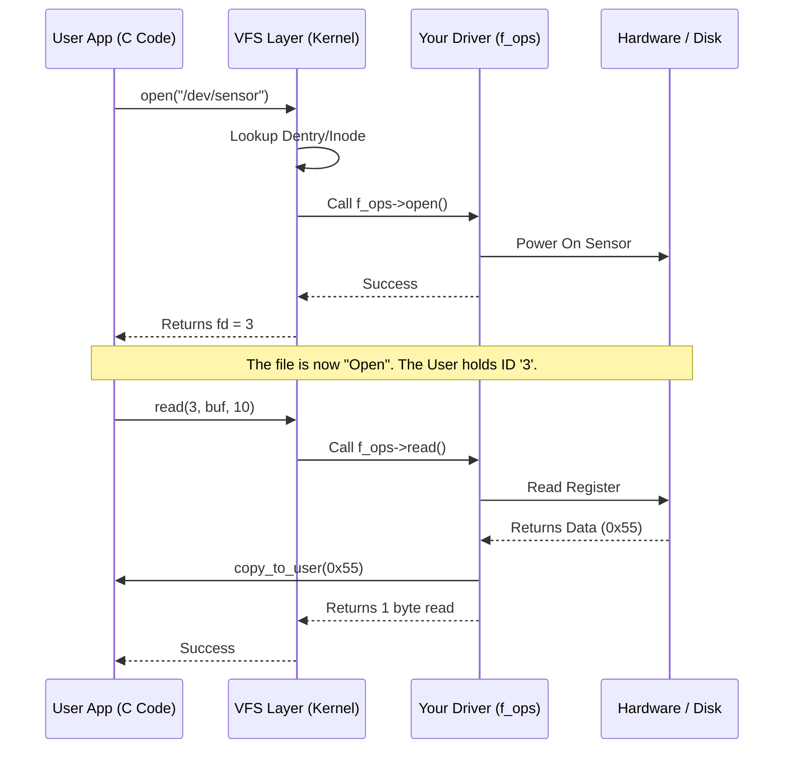

# Chapter 13: [The Virtual Filesystem]

## **Summary**

### Introduction

- The *Virtual Filesystem* (sometimes called the *Virtual File Switch* or more commonly simply the *VFS*) is the subsystem of the kernel that implements the file and filesystem-related interfaces provided to user-space programs.
- It is the architectural reason why Linux can handle dozens of different filesystems (ext4, fat32, nfs, btrfs) transparently.
- Whether you are accessing a local hard drive, a USB stick, or a network share, the VFS makes them all look and behave exactly the same to the programmer.
  
- **Q: What is the primary job of the VFS?**
	- To allow user-space programs to use standard system calls (like `open`, `read`, `write`) without needing to know _what_ kind of filesystem or hardware they are accessing.

- **Q: Why is this important for an embedded developer?**
	- It means your application code is portable. You can write a logger that writes to a file, and later decide to save that file to a RAM disk, a Flash chip, or a network server without changing a single line of your C code.

### Common Filesystem Interface

- The VFS creates a unified programming model known as the Common Filesystem Interface. This is the realization of the Unix philosophy "Everything is a file". This interface ensures that specific system calls work identically across all supported filesystems and storage media.

- **Q: What are the core system calls in this interface?**
	- `open()`, `read()`, `write()`, `lseek()`, and `close()`.

- **Q: How does this interface simplify the Operating System design?**
	- It decouples the "what" from the "how." The user specifies _what_ they want to do ("Read 5 bytes"), and the VFS figures out _how_ to do it based on the specific storage device involved.

- **Q: In the embedded world, we write logs to RAM (tmpfs), config files to Flash (JFFS2), and data to an SD Card (FAT32). Do we need different C code for each?**
	- No. Linux provides a Common Filesystem Interface. You use the exact same system calls—`open()`, `read()`, `write()`, `close()`—regardless of the underlying hardware or storage format.

- **Q: Who guarantees that `write()` works the same way on a vintage floppy disk as it does on a modern NVMe SSD?**
	- The **Kernel**. Specifically, the VFS layer ensures that every filesystem implements a basic set of behaviors to support these standard calls.


### Filesystem Abstraction Layer

- The VFS acts as an Abstraction Layer or "glue" between the User Application and the actual filesystem implementation (like the code that knows how to read an NTFS partition). This layer handles the generic logic (like checking permissions) and then passes the actual work down to the specific driver.

- **Q: What exactly is the VFS (Virtual Filesystem)?**
	- It is a software layer in the kernel that sits between the User Application and the actual filesystem drivers (like ext4, NFS, vfat). It acts as a "Universal Translator."

- **Q: How does the kernel call a specific function (like "write to FAT32") without knowing it in advance?**
	- Through **Function Pointers**. The VFS defines a generic function pointer (e.g., `write`). When you mount a filesystem, the kernel points that generic pointer to the specific driver's function (e.g., `fat_file_write`).
		- _Code View:_ `ret = file->f_op->write(file, buf, len, &pos);`
		- Here, `f_op` (file operations) is the bridge.

- **Q: Can you visualize this abstraction?**
	- Yes. Think of it like a Universal Power Adapter.
	  
	  ```mermaid
	  graph TD
	    UserApp["User App: write()"] -->|Standard Plug| VFS["VFS Layer: The Adapter"]
	    VFS -->|Generic Interface| EXT4[Ext4 Driver]
	    VFS -->|Generic Interface| FAT32[FAT32 Driver]
	    VFS -->|Generic Interface| NFS[NFS Driver]
	    EXT4 --> SSD[(SSD)]
	    FAT32 --> SD[(SD Card)]
	    NFS --> Net[(Network)]
	  ```


### Unix Filesystems

- **Q: Historically, how does Unix view a file differently than other systems?**
	- Unix separates the **content** of the file from the **information** about the file.
		- **The Content:** Just a stream of bytes.
		- **The Info:** Stored in a separate structure called an **Inode**.

- **Q: What is an Inode (Index Node)?**
	- It is the identity card of the file. It contains permissions, size, owner, timestamps, and pointers to the disk blocks where data is stored.
	- _Crucial Detail:_ The Inode does **NOT** contain the filename.

- **Q: If the Inode doesn't have the filename, where is it stored?**
	- In a **Directory**. In Unix, a directory is just a special file that contains a list of pairs: 
	  `{ "Filename" : Inode_Number }`.

- **Q: What is the "Superblock"?**
	- It acts as the header for the _entire_ filesystem. It describes the disk geometry, block size, and filesystem state (clean/dirty).

- **Q: What are the four main components of the Unix filesystem model?**
	1. **Files:** The actual user data (ordered string of bytes).
	2. **Inodes:** The metadata (owner, permissions, location on disk).
	3. **Directories:** Lists mapping readable names to inodes.
	4. **Superblock:** The map of the entire filesystem (block size, total size, free space).


### VFS Objects and Their Data Structures

- The VFS is built on an Object-Oriented framework. Since C doesn't support "classes" or "inheritance" natively like C++ or Java, the kernel developers implement them manually using `structs`. Each VFS object consists of two parts:
	1. **The Data:** Variables describing the object (like `block_size` or `file_size`).
	2. **The Operations:** A pointer to a table of functions that operate on that data.

- **Q: What are the "Operation Objects"?**
	- Think of the "Primary Object" as a **Machine** and the "Operations Object" as the **User Manual**.
		- The `struct inode` contains the data (permissions, size).
		- The `struct inode_operations` contains the functions (`create`, `link`, `mkdir`).
		- Every primary object has a pointer to its specific operations object (e.g., `i_op`).

- This structure allows the kernel to treat a FAT32 filesystem (which doesn't have inodes) as if it _did_ have them, by creating "fake" objects in memory on the fly.

- **Q: Since Linux supports non-Unix filesystems (like FAT32 on your SD card) which don't have inodes, how does VFS handle them?**
	- The VFS creates **In-Memory Objects**. When you mount a FAT32 drive, the Linux driver reads the FAT headers and constructs **fake inodes** in the RAM. This allows the rest of the kernel to treat the SD card exactly like a native Linux filesystem.

- **Q: What are the four primary Object Types in VFS?**
	1. **Superblock Object:** Represents a mounted filesystem (e.g., "The whole SD Card").
	2. **Inode Object:** Represents a specific file on that disk (e.g., "The metadata for `sensor_log.txt`").
	3. **Dentry Object:** Represents a directory entry; a single component of a path (e.g., "The folder `/home`" or the name "`sensor_log.txt`").
	4. **File Object:** Represents a file _opened by a process_. It tracks things that change in memory, like the current read position.

- **Q: Why do we distinguish between an Inode Object and a File Object?**
	- **Inode Object:** Represents the file on the **Disk**. There is only **one** inode per file, no matter how many people open it.
	- **File Object:** Represents the **Open Instance**. If two processes open the same file, there will be **two** File Objects (each with its own cursor position), but they will both point to the **same** Inode Object.

	- **Analogy:**
		- **Inode**: The Movie file on Netflix servers. (It exists once).
		- **File Object**: Your specific viewing session. (You are at minute 45:00, your friend is at minute 10:00. Two sessions, one underlying movie).

- **Q: Is there a specific "Directory Object"?**
	- No. As per the Unix philosophy, a directory is just a file. The VFS treats directories as normal files that happen to list other files. The **Dentry** handles the navigation (path) part, but the directory's data is stored in an **Inode**, just like a text file.


### The Superblock Object

- The Superblock is the anchor of any filesystem. It describes the "global" properties of the mounted partition.
- When you mount a USB stick, the kernel reads the first sector (usually) to find the superblock. If the kernel can't read the superblock (or if the "Magic Number" is wrong), it will refuse to mount the drive.

- **Q: What kind of information does the Superblock store?**
	-  It stores the "Geometry" and "State" of the filesystem.
		- **Block Size:** Is the drive writing in 1KB chunks or 4KB chunks?
		- **Max File Size:** How big can a single file be?
		- **Dirty Flag:** Was the power cut before data was saved?
		- **Magic Number:** A unique ID verifying this is actually an ext4 (or FAT) partition.

- **Q: What happens if the filesystem is virtual (like `sysfs` or `proc`) and not on a disk?**
	- The kernel generates the superblock on the fly in RAM. Since there is no physical disk to read from, the driver fills the `struct super_block` with default values in memory when you mount it.

- The code for creating, managing, and destroying superblock objects lives in `fs/super.c`. A superblock object is created and initialized via the `alloc_super()` function. When mounted, a filesystem invokes this function, reads its superblock off of the disk, and fills in its superblock object.

- **Analogy:**
	- The Superblock is the **Blueprint of a Warehouse**.
	- It doesn't tell you what is in Box #5 (that's the Inode).
	- It tells you: "This warehouse has 100 aisles, each shelf holds 50kg, and the lights are currently On."


### Superblock Operations

- The `super_operations` structure is a table of function pointers. This is how the generic VFS communicates with the specific filesystem driver to manage the filesystem. This section explains _how_ C mimics C++ style method calls.

- **Q: How does the kernel call a method on the superblock?**
	- It follows the pointer path: `sb->s_op->write_super(sb);`
		1. `sb`: The Superblock object.
		2. `s_op`: The table of operations.
		3. `write_super`: The specific function (e.g., `ext4_write_super`).

- **Q: Why do we pass `sb` as an argument to its own function?**
	- In C++, when you call `obj.method()`, the compiler secretly passes `this` (a pointer to `obj`). In C, we must pass it explicitly.
		- _The code:_ `sb->s_op->write_super(sb)` literally means: "Hey Superblock, look up your 'write' function, and apply it to _yourself_."

- **Let's look at some critical operations :**
  
	|Function|Purpose|Embedded Context|
	|---|---|---|
	|`alloc_inode`|Creates a new inode structure.|You type `touch file`. The generic code calls this specific driver function to prep the memory.|
	|`write_inode`|Writes inode metadata to disk.|You changed permissions (`chmod`). This saves the new permissions to the Flash/SD card.|
	|`dirty_inode`|Marks the inode as "changed".|Critical for Journaling (ext4). It tells the system "This file is newer in RAM than on disk."|
	|`sync_fs`|Flushes all metadata to disk.|Crucial. This is what happens when you run the `sync` command before pulling the power plug.|
	|`put_super`|Releases the superblock.|Called when you `umount` the drive.|


- **Q: What is `statfs`?**
	- When you run the command `df -h` to see free space, the VFS calls `sb->s_op->statfs`. The driver calculates free blocks and returns the stats.

- **Visualizing the "Method Call" in C:**
  
  ```mermaid
	graph LR
    Kernel_Call[Kernel wants to Sync] --> Pointer_Lookup
    
    subgraph "Struct Superblock (sb)"
        Pointer_Lookup[sb->s_op] --> Ops_Table
    end

    subgraph "Struct Super Operations"
        Ops_Table[write_super pointer] --> Driver_Func
    end
    
    subgraph "FAT32 Driver Code"
        Driver_Func[fat_write_super] --> Hardware[Write to SD Card]
    end
    
    style Kernel_Call fill:#f9f,stroke:#333
    style Hardware fill:#bfb,stroke:#333
  ```


### The Inode Object

- The **Inode** (Index Node) represents all the metadata needed by Kernel to manipulate a file or directory.
- While the **Superblock** describes the "Warehouse," the **Inode** describes a specific "Box" in that warehouse.
- Crucially, the Inode object is constructed in memory _only when the file is accessed_. If you have 1 million files on your SD card, you do _not_ have 1 million inodes in RAM. You only have inodes for the files you are currently touching.

- **Q: What information does an Inode hold?**
	- Everything _except_ the filename and the actual file content.
		- `i_uid`: Who owns it? (User ID).
		- `i_size`: How big is the file in bytes?
		- `i_atime`, `i_mtime`: When was it last read or modified?
		- `i_blocks`: How many disk blocks does it actually use?
		- `i_private`: A pointer for the specific driver (e.g., ext4) to store its own secret data.

- **Q: Why does the `struct inode` has the following `union` inside it?**
  ```c
		union {
			struct pipe_inode_info *i_pipe; /* pipe information */
			struct block_device *i_bdev;    /* block device driver */
			struct cdev *i_cdev;            /* character device driver */
		}
  ```

	- This is a memory-saving trick. An inode can represent a **File**, a **Pipe**, a **Block Device**, OR a **Character Device**. It cannot be all of them at once.
		- The `union` ensures that `i_pipe`, `i_bdev`, and `i_cdev` share the exact same memory location.
		- If it's a pipe, the kernel uses that RAM for pipe info. If it's a block device (like a disk), it uses that _same_ RAM for block info.
	- **Visualization:**
	  ```mermaid
			classDiagram
		    class Inode_Memory {
		        Common Data (Owner, Size, Permissions)
		        UNION AREA (Shared Memory Space)
		    }
		    
		    class Usage_A {
		        i_pipe (If file is a Pipe)
		    }
		    class Usage_B {
		        i_bdev (If file is a Block Device)
		    }
		    class Usage_C {
		        i_cdev (If file is a Char Device)
		    }
		
		    Inode_Memory --|> Usage_A : Use Option 1
		    Inode_Memory --|> Usage_B : OR Option 2
		    Inode_Memory --|> Usage_C : OR Option 3
	  ```


### Inode Operations

- Just like the Superblock, the Inode has an operations table (`i_op`). These functions allow the VFS to manipulate the _file entity itself_, not the data inside it.
	- **Data Operations** (like `read/write`) are in `file_operations` (we will see this later).
	- **Entity Operations** (like `create`, `mkdir`, `chmod`) are in `inode_operations`.

- **Q: What is the most famous function in this list?**
	- `lookup`.
		- When you type `vim /home/user/log.c`, the kernel has to translate the name "log.c" into an Inode Number. The `lookup` function searches the directory to find that inode.

- **Q: What is the difference between `create` and `mknod`?**
	- `create`: Makes a regular text/binary file.
	- `mknod`: Makes a "special" file, like a device node (e.g., `/dev/ttyUSB0`) or a named pipe.

- **Q: What happens when you run `chmod 777 file`?**
	- The VFS calls `setattr`. This function updates the `i_mode` bits in the inode object, and then (usually) marks the inode as "dirty" so it gets written back to the disk.

- **Q: Why is `mkdir` here? Isn't a directory different from a file?**
	- Remember, in Linux, **a directory is just a file** that holds a list of names. So, creating a directory is an operation performed on the _parent_ directory's inode.

#### Modern Usage:

- **The "Year 2038" Problem**
	- In the `struct inode`, there are following members:
		- `struct timespec i_atime;  /* last access time */`
		  `struct timespec i_mtime;  /*last modify time*/`
		  `struct timespec i_ctime;  /* last change time */`
		- The structure `timespec` uses a 32-bit integer for seconds. In the year 2038, this number will overflow (like Y2K), and systems will think it's the year 1901.
	- Linux has migrated internal timestamps to 64-bit integers. Even on a 32-bit ARM processor, the kernel now does 64-bit math for time to ensure your embedded device survives past 2038.

- **RCU (Read-Copy-Update) Path Walking**
	- **Old Kernel:** Implicitly assumes that when we look up a file, we might grab a "Lock" (Spinlock or Semaphore) to prevent others from changing the directory while we read it.
	- **Modern Kernel:** Heavy use of RCU.
		- Modern VFS tries to do `lookup` _without taking any locks at all_. This makes file access incredibly fast on multi-core ARM chips because CPUs aren't fighting over locks just to see if a file exists. You will see `i_rcu` fields in the modern inode struct.

-  **The `atomic_open` Operation**
	- **Old Kernel:** Describes `lookup` (find the file) and `create` (make the file) as separate steps.
	- **Modern Kernel:** Introduced `atomic_open`.
		-  If you try to open a file that doesn't exist with the `O_CREAT` flag, the modern kernel can look it up and create it in one single driver call. This drastically improves performance for network filesystems (NFS) and flash filesystems by reducing the "chatter" between the VFS and the driver.


### The Dentry Object

- The Inode represents the _file_, but the Dentry represents the _path_ to that file.
- When you access `/bin/vi`, the kernel has to resolve three things: `/` (root), `bin` (directory), and `vi` (file). In the VFS eyes, **all three are Dentries**.
- The VFS creates these objects on-the-fly when you access a file. They are not stored on the Hard Disk/SD Card. They exist purely in RAM to map a "String Name" to an "Inode Number."

- **Q: Why do we need a separate Dentry object? Why not just put the name in the Inode?**
	- Because of **Hard Links**. In Linux, one file (Inode #50) can be known as `/home/app` AND `/var/logs/app`.
		- One Inode (The actual data).
		- Two Dentries (Two different names pointing to that same inode).

- **Q: Can you visualize the relationship between Dentry and Inode?**
	- Yes. Think of a Library Book.
		- **The Inode:** The physical book itself (The pages, the cover, the weight).
		- **The Dentry:** The Index Card in the catalog that tells you "Harry Potter is on Shelf B, Row 3."
		- If the library has two index cards (Title card and Author card) pointing to the same book, those are two Dentries pointing to one Inode.

- **Q: Does the Dentry get saved to the SD Card?**
	- **No**. The Dentry is a creature of RAM. When you pull the power, all Dentries vanish. The kernel reconstructs them from the directory data on the disk the next time you boot up.


#### Dentry State

- Because Dentries are a cache of "Path-to-Inode" mappings, managing their lifecycle is crucial for memory management. A Dentry can be in one of three states: **Used**, **Unused**, or **Negative**.

- **Q: What is a "Used" Dentry?**
	- It corresponds to a valid inode, and someone is currently using it (like an open file). You cannot delete this dentry from RAM because a process needs it.

- **Q: What is an "Unused" Dentry?**
	- It corresponds to a valid inode, but nobody is using it _right now_.
		- _Example:_ You ran `ls`, the kernel created dentries for the files it saw, and then `ls` finished.
		- The kernel keeps these in RAM just in case you run `ls` again immediately. This saves CPU time.

- **Q: What is a "Negative" Dentry? (This is important!)**
	- It maps a filename to... **Nothing**. This happens when you try to open a file that _doesn't exist_. The kernel caches the fact that "this file does not exist."

- **Q: Why on earth would we cache a "File Not Found" error?**
	- Performance. Think of a compiler compiling code. It looks for `include.h` in `/usr/include`, then `/usr/local/include`, etc. It fails many times before finding it. If the Kernel didn't cache the "Not Found" result, the driver would have to physically scan the SD card every single time just to say "Nope, still not here." Negative Dentries save massive amounts of I/O.

#### The Dentry Cache (dcache)

- String comparison (comparing "home" to "home") is slow for a CPU. Reading off an SD card is even slower.
- The *dcache* is a mechanism to speed up file path lookup. It essentially creates a Hash Table so the kernel can turn a string path into an Inode pointer almost instantly.

- **Q: How does the kernel find a file using the dcache?**
	- It uses a Hash Function. When you ask for `/bin`, the kernel hashes the string "bin" to get a number. It looks at that number in the dcache.
		- **Hit:** It gets the Inode immediately. (Nanoseconds).
		- **Miss:** It has to ask the filesystem driver to read the disk. (Milliseconds).

- **Q: What is the LRU (Least Recently Used) list?**
	- It's the cleanup crew. Embedded systems have limited RAM. When RAM gets full, the kernel looks at the "Unused" dentries. It deletes the ones that haven't been touched in the longest time to free up memory.


### Dentry Operations

- The `dentry_operations` structure allows specific filesystems to override how names are handled. While the generic VFS handles most logic, some filesystems have unique rules—specifically regarding **Case Sensitivity**.

- **Q: Why is `d_compare` important for embedded developers?**
	- Because of **FAT32** (SD Cards) vs **Ext4** (Internal Flash).
	- **Ext4** is Case Sensitive (`Image.jpg` is different from `image.jpg`). The default VFS comparison works fine.
	- **FAT32** is Case Insensitive. The FAT driver must provide a custom `d_compare` function so that when you ask for `IMAGE.JPG`, it matches `image.jpg`.

- **Q: What is `d_revalidate` used for?**
	- Network Filesystems (NFS). If you are mounting a folder from a server, the file might have been deleted on the server side by another computer. `d_revalidate` asks the server: "Hey, is this cached dentry still valid, or did things change?"


#### Modern Usage:

- The Dentry system is one of the most optimized parts of the Linux kernel. In modern kernels (v6.x), the changes are purely about **Speed** and **Scalability**.

- **RCU Path Walking (The biggest change)**
	- **Old Kernel:** Looking up a dentry involves taking locks (spinlocks) to ensure safety.
	- **Modern Kernel:** Uses RCU (Read-Copy-Update) for path walking.
		- When a modern server (or a multi-core embedded chip like i.MX8 or RPi 4) looks up a file path, it usually takes **Zero Locks**. It reads the dentry data while other processes might be writing to it, using clever memory barriers to ensure it sees consistent data.
		- **Impact**: This makes file lookups insanely fast on multi-core systems.

- **Encryption (fscrypt)**
	- **Context:** Modern Android and Embedded Linux devices often encrypt user data.
	- **Modern Kernel:** The Dentry layer now interacts tightly with fscrypt.
		- If you look at the raw disk, the filename is scrambled (e.g., `Xy9z...`).
		- The Dentry cache sees the clear text name (e.g., `photo.jpg`) only if the user has the correct key in their keyring. The `d_revalidate` and `d_compare` operations are much more complex now to handle this encryption transparently.

- **OverlayFS (Docker/Containers)**
	- **Context:** If your embedded device uses containers or an A/B partition update scheme using OverlayFS.
	- **Modern Kernel:** "Negative Dentries" are crucial here. OverlayFS layers a "Read Only" root filesystem with a "Read Write" upper layer. The VFS has to handle "Whiteouts"—dentries that represent a file that was "deleted" in the upper layer but still exists in the lower layer. The logic for `d_hash` and `d_compare` is heavily modified to support these layered views.


### The File Object

- **This is the part of the subsystem you interact with every single day as a driver developer. When you write a character driver for a sensor or a UART, you are primarily filling out the `struct file_operations` table.**

-  While the Inode represents the file on the disk (static), the File Object represents an active session (dynamic).
- The File Object is created when a process calls `open()`. It tracks _state_ specific to that interaction, such as "Where is the cursor right now?" (`f_pos`) or "Is this opened for Read-Only or Read-Write?" (`f_mode`).

- **Q: Does the File Object exist on the disk?**
	- **No.** It is purely a creature of RAM. If you have a file `log.txt` on your SD card, there is one Inode on the disk. If Process A opens it, and Process B opens it, you have two File Objects in RAM, both pointing to that single Inode.

- **Q: Why do we need separate objects for the File and the Inode?**
	- To allow multiple processes to read the same file independently. Imagine two people reading the same physical book (The Inode).
		- Person A is on page 10.
		- Person B is on page 200.
		- The "Current Page Number" (`f_pos`) is stored in the File Object, not the book itself.

- **Q: What is `f_count` (Reference Count)?**
	- It tracks how many processes are using this specific file handle.
	    - If you `open()` a file, `f_count` = 1.
	    - If you `fork()` a process, the child inherits the open file, so `f_count` becomes 2.
		    - The file is not actually closed (and memory freed) until `f_count` drops to 0.

- **Visualization: Inode vs. File Object**
  
  ```mermaid
	  graph TD
		Inode["Struct Inode (Physical File on Disk)"]
		
		FileObjA["Struct File A (Process 1)"]
		FileObjB["Struct File B (Process 2)"]
		
		FileObjA -- points to --> Inode
		FileObjB -- points to --> Inode
		
		subgraph "Process 1 State"
		FileObjA -- f_pos = 100 bytes --> A_Cursor
		end
		
		subgraph "Process 2 State"
		FileObjB -- f_pos = 5000 bytes --> B_Cursor
		end
  ```


### File Operations (f_ops)

- The `file_operations` structure is the "Control Panel" for your driver. When the user calls a system function like `read()`, the VFS looks at this table to figure out which function inside your driver to call. As an embedded developer, 90% of your driver code is just implementing these functions.

- **Q: What is `llseek`?**
	- It stands for "Long Long Seek." It updates the file pointer (`f_pos`).
		- If your driver doesn't support seeking (like a keyboard stream or a UART), you should set this to a special error function or `no_llseek`.

- **Q: `lseek` vs `llseek`?**
	- This is purely about the **size** of the variable used to store the position.
	- **The Concept:** A file is like a cassette tape. You have a "Head" (cursor).
        - `read()` plays the tape and moves the head forward.
	    - `seek()` allows you to Fast Forward or Rewind the head without reading.
	- **`lseek` (Long Seek):**
        - Uses a standard C `long` type.
	    - On 32-bit systems (standard ARM), a `long` is 32 bits.
	    - Max value = $2^{31} - 1 \approx 2 \text{ Gigabytes}$.
	    - **Problem:** If you have a movie file that is 4GB, `lseek` cannot reach the end of the file. It overflows.
	- **`llseek` (Long Long Seek):**
		- Uses `long long` (64 bits).
		- Max value = Exabytes.
		- This was introduced to solve the "2GB Limit" problem.
	- **In Modern Kernel Drivers:** You will almost always see `.llseek` in the `file_operations` structure. Even if your embedded device only has 256MB of flash, the kernel uses the 64-bit interface for consistency.
		- **Helper:** The kernel provides a generic function `generic_file_llseek` so you usually don't have to write this yourself unless you are doing something weird.

- **Q: What is `mmap`?**
	- Memory Map. This allows a user to map a file (or hardware registers!) directly into their memory space.
		- **Embedded usage:** This is how you access GPIOs or special hardware blocks from user space without the overhead of calling `read/write` constantly.

- **Q: What is `poll`?**
	- This is used for non-blocking I/O. A user program calls `poll()` or `select()` to ask: "Is there any data ready for me to read yet?"
	    - Your driver's `poll` function checks the hardware buffer and returns "Yes" or "Sleep until interrupt."

- **Q: What is `flush` vs `release`?**
	- `release`: Called when the last user closes the file (`f_count` hits 0). This is where you turn off the hardware.
	- `flush`: Called every time any user calls `close()`, even if other users still have it open. It's rarely used in simple drivers.


#### Deep Dive: `file_operations` for Driver Devs

- Let's look at the Real World implementation of these operations in an embedded context.
- Imagine you are writing a driver for a **Hardware Random Number Generator (RNG)**.

1. **`open`**
	- **Goal:** Prepare the device.
	- **What you write:**
	    - Check if the hardware is busy.
	    - Enable the clock to the RNG peripheral to save power.
	    - Allocate a temporary buffer in kernel RAM.
	- **Code Snippet:**
	  ```c

		static int my_rng_open(struct inode *inode, struct file *file) {
			// Enable Hardware Clock
			writel(ENABLE_BIT, RNG_REGISTER_BASE);
			return 0; // Success
		}
	  ```

2. **`read`**
	- **Goal:** Send data to the user.
	- **The Critical Concept:** User Space Memory vs Kernel Space Memory.
	    - You (the kernel) cannot just write to the user's variable directly. The MMU (Memory Management Unit) protects them.
	    - You **MUST** use `copy_to_user()`.
	- **What you write:**
	    - Read the hardware register.
	    - Safely copy that byte across the memory boundary.
	- **Code Snippet:**
	  ```c
		 static ssize_t my_rng_read(struct file *file, char __user *user_buf,
									 size_t count, loff_t *ppos) {
			 unsigned int data = readl(RNG_DATA_REG);
			 
			 // This is the Magic Bridge function
			if (copy_to_user(user_buf, &data, sizeof(data))) {
				 return -EFAULT; // Failed to copy
			}
			return sizeof(data); // "I read 4 bytes"}
	  ```

 3. **`write`**
	- **Goal:** Receive configuration or data from the user.
	- **The Critical Concept:** You must use `copy_from_user()`.
	- **Example:** Maybe the user writes a "Seed" value to the RNG.
	  ```c
		static ssize_t my_rng_write(struct file *file, const char __user *user_buf,
									size_t count, loff_t *ppos) {
			unsigned int seed;
			
			// Fetch data from user app
			if (copy_from_user(&seed, user_buf, sizeof(seed))) {
				return -EFAULT;
			}
			writel(seed, RNG_SEED_REG);
			return count;
		}
	  ```

 4. **`unlocked_ioctl`**
	- **Goal:** Control commands (Not reading/writing data).
	- **Example:** "Reset the RNG hardware."
	  ```c
		static long my_rng_ioctl(struct file *file, unsigned int cmd,
									unsigned long arg) {
			switch(cmd) {
				case RNG_RESET_CMD:
					writel(RESET_BIT, RNG_CTRL_REG);
					break;
				case RNG_SET_MODE_FAST:
					// Change hardware speed..
					break;
			}
			return 0;
		}
	  ```

 5. **`poll`**
	- **Goal:** Efficiency.
	- **Scenario:** The RNG takes 1 second to generate a number.
	    - **Bad way:** The user app sits in a `while(1)` loop reading. This burns 100% CPU.
	    - **Good way (Poll):** The user app goes to sleep. Your driver's interrupt handler wakes up the user app only when data is ready.
	- **What you write:** You use `poll_wait()` to link the file object to a specific "Wait Queue."

##### Summary for you as a Developer: When you write a driver:

1. Define a `struct file_operations`.
2. Map `.read`, `.write`, `.open`, `.release`, `.unlocked_ioctl` to your C functions.
3. Register this structure with the kernel (using `cdev_add` for char drivers or `misc_register`).

- The VFS handles all the routing. When the user says "Read," the VFS routes it straight to your `my_rng_read` function.

#### The `ioctl` Mess

- `ioctl` (Input/Output Control) is the "Swiss Army Knife" of system calls. If you need to do something that isn't reading or writing data (like "Set Baud Rate" or "Eject CD"), you use `ioctl`. The book discuss three variations, which can be confusing.

- **Q: Why are there three versions (`ioctl`, `unlocked_ioctl`, `compat_ioctl`)?**
	- History and Architecture.
		1. **`ioctl` (The Old Way):** In very old kernels, this held a giant lock (BKL) that stopped the _entire OS_ while the driver worked. It's gone in modern kernels.
		2. **`unlocked_ioctl` (The Standard Way):** This is what you use today. It doesn't hold the Big Kernel Lock. You (the driver writer) are responsible for your own locking to prevent race conditions.
		3. **`compat_ioctl` (The Compatibility Way):**
		    - Imagine you have a 64-bit Kernel (ARM64) but you run a 32-bit User App (ARMhf legacy app).
		    - The 32-bit app sends a 32-bit pointer. The 64-bit kernel expects a 64-bit pointer.
		    - `compat_ioctl` translates the data so the kernel understands the legacy app.


#### Modern Usage:

- The `struct file_operations` has evolved significantly to handle high-performance I/O.

- **`aio_read` / `aio_write` are gone**
	- **Old Kernel:** Shows `aio_read` and `aio_write` for Asynchronous I/O.
	- **Modern Kernel:** These have been replaced by `read_iter` and `write_iter`.
	    - Instead of passing a simple buffer (`char *buf`), the kernel passes a `struct iov_iter`. This structure can point to multiple chunks of memory scattered across RAM (Scatter-Gather I/O). It allows for "Zero Copy" operations, which is huge for high-speed cameras or networking.

- **The Death of the Big Kernel Lock (BKL)**
	- **Old Kernel:** Talks about `unlocked_ioctl` as a "new" thing to avoid the BKL.
	- **Modern Kernel:** The BKL is completely dead and buried. The field `ioctl` (the old one) doesn't even exist in the structure anymore. You must implement `unlocked_ioctl`.

- **`splice` (Zero Copy)**
	- **Old Kernel:** Mentions `splice_read` and `splice_write` briefly.
	- **Modern Kernel:** These are critical for performance.
	    - `splice` allows you to move data from a Driver to a Network Socket without ever copying the data into User Space RAM. The data stays in Kernel RAM the whole time.
	    - _Example:_ Streaming video from a camera driver directly to a Wi-Fi driver.

- **`f_op` is now const**
	- Modern Kernel: You will notice in modern drivers:
	  ```c
			static const struct file_operations my_fops = { ... };
		```
	- The structure is marked `const` (read-only) for security. This prevents hackers from overwriting your function pointers in RAM to hijack the kernel execution flow.


### Connecting the Dots: User Space to VFS

- As a Kernel Developer, you need to understand how the code you write connects to the application layer.
-  The user application never sees a Superblock, Dentry, or Inode. Those are kernel internal secrets.
- The User Application only sees one thing: A File Descriptor (`fd`). This is just a simple integer (like `3`).
- Here is the journey of a standard command like `cat /home/log.txt`:

#### Step 1: The Setup (open)
1.  **User App:** Calls `open("/home/log.txt", O_RDONLY)`.
2. **VFS (Kernel):**
	- Looks at the Superblock to see if the partition is mounted.
	- Uses Dentries to walk the path: Root `/` $\to$ `home` $\to$ `log.txt`.
	- Finds the Inode for `log.txt` (fetches permissions/size from disk).
	- Creates a File Object in RAM to represent this specific session.
	- Assigns an integer (e.g., `fd = 3`) to that File Object.
3. **Return:** The kernel returns `3` to the user app.

#### Step 2: The Action (read)
1. **User App:** Calls `read(3, buffer, 100)`. ("Read 100 bytes from file #3").
2. **VFS (Kernel):**
	- Looks up the File Object associated with ID `3`.
	- Checks the `f_op` (File Operations) table inside that object.
	- Calls the specific function: `file->f_op->read(...)`.
3. **Your Driver:**
	- The code _you_ wrote executes. It talks to the hardware, gets the data, and copies it to the user's buffer.

#### Visual Sequence



### Data Structures Associated with Filesystems

- In Linux, there is a strict separation between the Code that knows how to read a disk (the Driver) and the Actual Disk mounted on the system (the Mount Point).
	- The kernel needs to know "How to speak Ext4" even if no Ext4 disks are plugged in.
	- Once you plug in a disk, the kernel creates a specific instance representing that connection.

- **Q: What is the `file_system_type` structure?**
	- This represents the **driver code**. There is only **one** `file_system_type` object in memory for "ext3", one for "ext4", and one for "fat32". It contains the name (e.g., "ext3") and a pointer to a function (`get_sb`) that creates the superblock.
	- _Analogy:_ This is the **Blueprint** for a specific model of car (e.g., Ford Mustang). You can't drive the blueprint, but it tells the factory how to build the car.

- **Q: What is the `vfsmount` structure?**
	- This represents a **specific mounted instance**. Every time you run the `mount` command, the kernel creates a `vfsmount`.
		- If you mount your SD card at `/mnt/sd` and a USB stick at `/mnt/usb`, you have two `vfsmount` objects.
		- _Analogy:_ These are the **Actual Cars** in the parking lot. You might have two Ford Mustangs (two `vfsmounts` using the same `file_system_type`), but they are distinct physical objects.

- **Q: Why do we need `vfsmount`? Why not just use the Superblock?**
	- Because of complex directory trees. The `vfsmount` links a Superblock (the disk) to a Dentry (the directory where you attached it, e.g., `/mnt`). It also tracks flags specific to _that_ connection, like `MNT_RDONLY` (Read-Only). You might mount the _same_ disk in two different places with different permissions!

- **Visualization: Driver vs. Instance**
  ```mermaid
	  classDiagram
		class file_system_type {
			"The Code / Blueprint"
			Name: "ext4"
			Function: read_super()
		}
		
		class vfsmount_A {
			"Instance 1"
			Mount Point: /home
			Flag: Read-Write
		}
		
		class vfsmount_B {
			"Instance 2"
			Mount Point: /var
			Flag: Read-Only
		}
		
		class Superblock_A {
			"Physical Disk A"
		}
		
		class Superblock_B {
			"Physical Disk B"
		}
		
		vfsmount_A --> Superblock_A : Points to
		vfsmount_B --> Superblock_B : Points to
		
		vfsmount_A ..> file_system_type : Uses logic from
		vfsmount_B ..> file_system_type : Uses logic from
  ```


### Data Structures Associated with a Process

- A filesystem is useless if no process interacts with it. When an application runs, the Kernel keeps track of three things regarding files:
	- "What files do I have open?" --> `files_struct`
	- "Where is my current directory?" --> `fs_struct->pwd`
	- "What filesystem tree can I see?" -->  `fs_struct->root`
- These are stored in the `task_struct` (Process Descriptor), which we studied in previous chapters.

- **Q: What is the `files_struct`?**
	- This is the **Open File Table**. It contains an array `fd_array`. When the user gets File Descriptor `3`, it simply means `fd_array[3]` points to a valid File Object.
		- This is local to the process. FD `3` in Process A is totally different from FD `3` in Process B.

- **Q: What is the `fs_struct`?**
	- This tracks the **Context**. It holds two pointers:
		1. `pwd`: The dentry of the Current Working Directory (where you are).
		2. `root`: The dentry of the Root Directory (usually `/`).
	- When you type `cd ..`, the kernel updates the `pwd` pointer in this struct.

- **Q: What is the `mnt_namespace`?**
	- This is the **View of the World**. By default, all processes share the same namespace (everyone sees `/`, `/home`, `/usr`). However, a process can have its own private namespace. This means it can have a unique set of mounts that no other process sees.
		- This is the foundation of **Containers** (Docker).

- **Visualization: The Process View**
  ```mermaid
	graph LR
    subgraph "Process (Task Struct)"
        Files[files_struct]
        FS[fs_struct]
    end

    subgraph "VFS Layer"
        FileObj["File Object (The Session)"]
        DentryPWD["Dentry (Current Folder)"]
        DentryRoot["Dentry (Root Folder)"]
    end

    Files -- "FD Array[3]" --> FileObj
    FS -- "pwd pointer" --> DentryPWD
    FS -- "root pointer" --> DentryRoot
  ```


#### Modern Usage:

- The way the kernel handles passing paths around has changed significantly since kernel 2.6 to improve safety and performance.

- **The `struct path` Wrapper**
	- **Old Kernel:** Often talks about passing a `dentry` and a `vfsmount` separately to functions.
	- **Modern Kernel:** Introduced `struct path`.
	  ```c
		struct path {
			struct vfsmount *mnt;
			struct dentry *dentry;
		};
	  ```
		- Almost all VFS functions now pass this `struct path` instead of loose pointers. This ensures that a Dentry is never separated from the Mount it belongs to, which prevents a whole class of reference counting bugs.

- **`get_sb` is now `mount`**
	- **Old Kernel:** Mentions `get_sb` (Get Superblock) in `file_system_type`.
	- **Modern Kernel:** This interface was redesigned. The function is now called `mount`. It gives the filesystem driver more control over how the root dentry is created and returned.

- **Namespaces are Everywhere (Containers)**
	- **Old Kernel:** Treats Namespaces as a somewhat obscure or advanced feature.
	- **Modern Kernel:** Namespaces are now a daily reality.
		- In modern Embedded Linux (using systemd or containers), services are often launched in their own `mnt_namespace` with `PrivateTmp=yes`.
		- This means the `/tmp` folder your driver sees might be different from the `/tmp` folder the application sees. This is a common "Gotcha" for developers trying to debug by dumping files to `/tmp`.

- **The `O_PATH` Flag**
	- **Modern Kernel:** You can now open a file _without_ intending to read or write it, just to reference its location in the filesystem.
		- `open(path, O_PATH)`
		- This creates a File Object that has no `f_op` (operations), but acts as a stable anchor ("handle") to a spot in the directory tree. This is used heavily by modern userspace tools to avoid race conditions.


## **Quick Recall**

- **Q: What are the "Big Four" objects of the VFS?**
	1. **Superblock:** Represents the entire filesystem (e.g., the whole partition).
	2. **Inode:** Represents a specific file's metadata (permissions, size, location on disk).
	3. **Dentry:** Represents the path/name (e.g., `/home/user`). Used for fast lookups.
	4. **File Object:** Represents an _active_ open session by a process (holds the cursor position).

- **Q: Which of the "Big Four" exist ONLY in RAM?**
	- **A:** The Dentry and the File Object.
		- _Why?_ A file's "name" is just a lookup key (Dentry), and the "cursor position" (File Object) is temporary state while a program runs. They vanish when power is lost.
		- The **Superblock** and **Inode** have persistent counterparts stored physically on the disk.

- **Q:  I have a file `data.log`. Two different programs open it at the same time. How many Inodes, Dentries, and File Objects are created?**
	- **Inodes:** 1 (It is physically one file).
	- **Dentries:** 1 (It has one name/path).
	- **File Objects:** 2 (Each program needs its own "cursor" and read/write mode).

- **Q: Why does the VFS exist? Why not let the application talk directly to the Ext4 driver?**
	- **A:** Abstraction.
		- The VFS allows the application to use generic system calls (`open`, `read`, `write`) without caring if the data is on a Hard Drive (Ext4), a USB stick (FAT32), or a Network Server (NFS).

- **Q:** As a driver developer, which structure do I edit the most?
	- **A:** `struct file_operations`
		- This is the lookup table where you tell the VFS: "When the user calls `read()`, run my function `my_driver_read()`."

- **Q: What is the difference between a `dentry` and a `vfsmount`?**
	- **Dentry:** A directory path (e.g., `home` inside `/`).
	- **vfsmount:** A specific instance of a filesystem mounted at a location.
	- _Analogy:_ Dentry is the "Garage" (location). vfsmount is the specific "Car" parked inside it.


## **Hands-on Ideas**

- **The "Observer": Seeing the VFS in User Space**
	- You don't need to write kernel code to see the VFS structures. Linux exposes them via the `/proc` filesystem (which is itself a VFS trick!).
	- **Task:**
		1. Open a terminal
		2. Run `ls -l /proc/self/fd`
			- **What you see:** A list of numbers (0, 1, 2, ...).
			- **Concept:** These are the **File Descriptors** in the `files_struct` of the `ls` process!
			- 0 = `stdin`, 1 = `stdout`, 2 = `stderr`.
		3. Run `cat /proc/self/maps`
			- **What you see:** Memory regions mapped to files.
			- **Concept:** This shows how **Inodes** (libraries like `libc.so`) are mapped into your process's memory.

- **The "Tracer": Watching the VFS Boundary**
	- This is the most useful skill for an embedded engineer. You can watch the transition from **User Space** to **VFS** to **Driver**.
	- **Task:**
		1. Create a dummy file: `echo "Hello Kernel" > test.txt`
		2. Run `strace cat test.txt`.
		3. Look at the output. You will see:
		   ```text
				openat(AT_FDCWD, "test.txt", O_RDONLY) = 3
				read(3, "Hello Kernel\n", 131072)      = 13
				write(1, "Hello Kernel\n", 13)         = 13
				close(3)
		   ```
	- **Analysis:** 
		- `openat`: The User asks VFS for a handle. VFS creates a **File Object** and returns FD `3`.
		- `read(3, ...)`: The User passes FD `3`. VFS looks up the **File Object**, finds the **Inode**, and calls the filesystem driver.
		- `close(3)`: VFS destroys the **File Object** and decrements the **Inode** reference count.

-  **The "Developer": Implementing `f_ops`**
	- This is the "Hello World" of kernel drivers. If you haven't done this recently, do it now.
	- **Task:** Write a simple generic kernel module that creates a character device.
		1. Define a `file_operations` struct.
		   ```c
				static const struct file_operations my_fops = {
					.owner = THIS_MODULE,
					.open = my_open,
					.read = my_read,
					.release = my_close,
				};
		   ```
		2. In `my_read`, just return a hard-coded string ("Hello from VFS").
		3. Load it (`insmod`).
		4. Read it from user space (`cat /dev/my_device`).
		    - **Goal:** Understand that `cat` (User) $\to$ `sys_read` (VFS) $\to$ `my_read` (Your Driver) is a direct chain of function calls.

- **The "performance check": Inspecting the Dcache**
	- Embedded systems run out of RAM. The **Dentry Cache** (dcache) and **Inode Cache** consume RAM to speed up lookups.
	- **Task:**
		1. Run `sudo slabtop`.
		2. Look for `dentry` and `inode_cache` in the list.
		    - **What you see:** The number of objects currently living in RAM.
		    - **Experiment:** Run `find / -name "*.conf"`. This forces the VFS to crawl the disk.
		    - **Observe:** Watch the `dentry` count in `slabtop` spike up. The kernel is creating thousands of dentry objects in RAM to remember the paths it just saw.